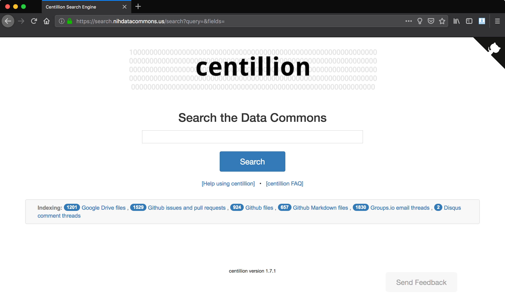

Title: First Post of the Fall, Part 1: Data Commons
Date: 2018-10-27 19:00
Updated: 2018-10-27 19:00
Category: Centillion
Tags: DCPPC, Data Commons, Github, Community, Science, Centillion

## Background: a bit about the Data Commons

It has been a productive but busy summer at the
[Lab for Data Intensive Biology](http://ivory.idyll.org/lab/).

As part of my job, I am supporting a lot of websites
and infrastructure for the [Data Commons Pilot Phase
Consortium (DCPPC)](https://public.nihdatacommons.us),
which wrapped up Phase 1 this month.

The Data Commons is a large-scale effort to establish
a community-driven set of standards for interoperability
for biological data and computation, a massive effort and
a broad mandate that has the potential to enable breakthrough
research that is currently impossible because data and computations
cannot inter-operate between the data, compute resources, and 
domain expertise that are provided by universities, hospitals, 
research institutes, companies, nonprofits, and citizen 
scientists.

## Informationally challenged: Data Commons growing pains

An important part of defining a community-driven set of standards is defining a
community, and toward that end the collective members of the Data Commons 
met at monthly face-to-face workshops to iterate tightly on a set of
technologies and standards that will allow each institution's different compute
platforms or data banks to use other institutions' platforms or data banks.
Doing this requirs fostering community and creating the right environment
for people to work through the issues. 

One of the biggest challenges we faced in fostering a community
that could develop and implement a set of standards across such 
a large and diverse group of experts and institutes was coordinating
information. Specifically, making sure that decisions were properly
communicated to the appropriate parties, that important documents
made their way to the entire consortium, and that documents that were
created and edited also be findable and sharable.

This problem began, back in April, as a very small trash fire.
People were getting used to the Github workflow and did not know
how to find the appropriate repository for the information they
needed to contribute, and consortium members were universally annoyed
that Google Drive's search functionality was so terrible.

In June we rolled out a trial document-tagging system to the consortium,
to deafening silence - no one was impressed or satisfied with the tagging
system. The real problem was with search.

Toward that end, I implemented a full-fledged search engine for the Data
Commons that utilized various third-party APIs (Github, Google Drive,
Groups.io, etc.) to index content related to the project, and make it
full-text-searchable.

The result was [centillion](https://github.com/charlesreid1/centillion),
the Data Commons search engine. This search engine provides a portal
to search for Data Commons-related Google Drive documents, Github issues,
Github pull requests, Github files, Groups.io email threads, and more.

Our story picks up with centillion.

## Presenting centillion, the Data Commons search engine

One of the tools I have made heavy use of in support of
web infrastructure for the DCPPC project is Flask, a Python
library for running a web server. Flask is a very powerful
library, but it starts with a relatively simple premise:
Flask lets you create a web appplication that will bind
to a particular port, and you can then add "routes" 
that are endpoints a user can visit, like `/hello/world`,
and link those routes to Python functions.

On Monday 2018-10-28 the DIB Lab's weekly lab meeting featured
yours truly covering the topic of [centillion](https://github.com/charlesreid1/centillion),
the Data Commons search engine.

centillion makes use of the Python library
[whoosh](https://whoosh.readthedocs.io/en/latest/intro.html)
under the hood, to provide search functionality, while the web 
front-end uses Flask to connect Python functions to a website 
that users can interact with.

**Screen shot of the centillion search engine (2018-10-27).**

## centillion architecture: the short version

As of version 1.7, centillion is packaged as a Python package.
The centillion package consists of two submodules, corresponding
to the Flask frontend and Whoosh backend, respectively: `webapp`
and `search`.

### webapp submodule

`centillion.webapp` implements the Flask app and defines all
routes. When the user runs a search, it passes the query string
on to a `Search` object from the `search` submodule. The `webapp`
submodule does not know anything about the details of the 
search engine or search index.

This submodule is located in `src/webapp/` in the 
[centillion repo](https://github.com/charlesreid1/centillion).

### search submodule

`centillion.search` implements a search engine using Whoosh,
a programming library for building search engines. Whoosh does not
implement any kind of front end, so its role is restricted entirely
to the back end.

The search submodule also handles interfacing with the Github, Google,
and Groups.io APIs and translating the results of API calls from these
services into documents whose contents can be extracted and indexed 
by Whoosh.

This submodule is located in `src/search/` in the 
[centillion repo](https://github.com/charlesreid1/centillion).

