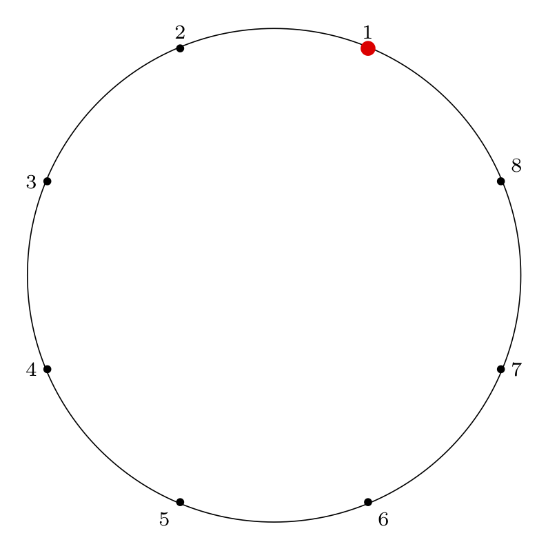

Title: The Josephus Problem: Part 2: Two Examples
Date: 2019-03-20 14:00
Category: Computer Science
Tags: graphs, puzzles, algorithms, josephus, latex

This is Part 2 of an N-part series.

* [The Josephus Problem: Part 1: The Problem](https://charlesreid1.github.io/the-josephus-problem-part-1-the-problem.html)
* [The Josephus Problem: Part 2: Two Examples](https://charlesreid1.github.io/the-josephus-problem-part-2-two-examples.html)
* [The Josephus Problem: Part 3: Solving the Double Step Case](https://charlesreid1.github.io/the-josephus-problem-part-3-solving-the-double-step-case.html)

[TOC]

## Two Examples

In this blog post we'll walk through two examples
of a Josephus problem:

$$
n = 8, m = 4
$$

and

$$
n = 11, m = 2
$$

We will simulate the Josephus process and
show how the solution is expressed using both 
permutation notation and cycle notation.

## n = 8, m = 4

We begin with the example that Knuth gives in his
problem statement, $n = 8, m = 4$, along with its
solution, $54613872$.

Here is the Josephus circle for this case, and the
corresponding removal index on the right (the red dot
indicates the starting point for the process):

<table>
<tr>
<td>
<b>Circle index:</b> 

</td>
<td>
<b>Removal index:</b> 

</td>
</tr>
</table>

### Step by Step Removal for n = 8

Starting at the red dot, we proceed $m-1$ points forward
through the circle ($m$ if we include the starting
point), skipping items that have already been removed,
and remove an item from the circle.

We indicate the starting point with a red dot in Step 0,
then indicate the removal index with a red dot and the
corresponding removal index.

<table>

<tr>
<td><b>Step 0: Starting Point
</b></td>
</tr><tr>
<td>

</td>
</tr>

<tr>
<td><b>Step 1:
</b></td>
</tr><tr>
<td>

</td>
</tr>

<tr>
<td><b>Step 2:
</b></td>
</tr><tr>
<td>

</td>
</tr>

<tr>
<td><b>Step 3:
</b></td>
</tr><tr>
<td>

</td>
</tr>

<tr>
<td><b>Step 4:
</b></td>
</tr><tr>
<td>

</td>
</tr>

<tr>
<td><b>Step 5:
</b></td>
</tr><tr>
<td>

</td>
</tr>

<tr>
<td><b>Step 6:
</b></td>
</tr><tr>
<td>

</td>
</tr>

<tr>
<td><b>Step 7:
</b></td>
</tr><tr>
<td>

</td>
</tr>

<tr>
<td><b>Step 8:
</b></td>
</tr><tr>
<td>

</td>
</tr>

</table>

### Writing the Solution Permutation: Two Row Notation

As mentioned in Part 1, we can think about the final removal order
of sushi plates (or mice, or soldiers) as a special permutation, 
the Josephus permutation. If we want to write the Josephus permutation
using the standard two-row notation for permutations, we would write
the circle order (the index of items around the circle) on the top row,
and the removal order (the index of items as they are removed) on the 
bottom row. This gives:

$$
\bigl(\begin{smallmatrix}
    1 & 2 & 3 & 4 & 5 & 6 & 7 & 8 \\
    5 & 4 & 6 & 1 & 3 & 8 & 7 & 2
\end{smallmatrix}\bigr)
$$

While this notation is more intuitive (makes it easier to answer
a variety of questions), it is also inconvenient notation, since
there are many equivalent ways of writing a single permutation.

### Writing the Solution Permutation: Cycle Notation

In Part 1 we also introduced cycles and cycle notation. Writing a
permutation as a cycle is a unique representation of that permutation.
By tracing which elements are permuted with other elements, we can
turn the two-row representation into a cycle representation.

Here is the Josephus permutation for $n = 8, m = 4$ 
in cycle notation:

$$
\left( 1 \, 5 \, 3 \, 6 \, 8 \, 2 \, 4 \right) \left( 7 \right)
$$

### Visual Representation of Solution Permutation

To represent the Josephus permutation graphically, we draw lines 
connecting the edges that permute and form cycles:

This is a visual representation of the Josephus permutation
for $n = 8, m = 4$.

## n = 11, m = 2

Next is an example with a step size of two, which
is a special case of the Josephus problem with a 
slightly easier solution procedure.

Here is the final Josephus permutation on a circle,
which is what our procedure below will yield:

<table>
<tr>
<td>
<b>Circle index:</b> 

</td>
<td>
<b>Removal index:</b> 

</td>
</tr>
</table>

### Step by Step Removal for n = 11

As before, we proceed from the red dot, moving
forward $m-1$ items and removing the $m^{th}$
item.

We indicate the starting point with a red dot in Step 0,
then indicate the removal index with a red dot and the
corresponding removal index.

<table>

<tr>
<td><b>Step 0: Starting Point
</b></td>
</tr><tr>
<td>

</td>
</tr>

<tr>
<td><b>Step 1:
</b></td>
</tr><tr>
<td>

</td>
</tr>

<tr>
<td><b>Step 2:
</b></td>
</tr><tr>
<td>

</td>
</tr>

<tr>
<td><b>Step 3:
</b></td>
</tr><tr>
<td>

</td>
</tr>

<tr>
<td><b>Step 4:
</b></td>
</tr><tr>
<td>

</td>
</tr>

<tr>
<td><b>Step 5:
</b></td>
</tr><tr>
<td>

</td>
</tr>

<tr>
<td><b>Step 6:
</b></td>
</tr><tr>
<td>

</td>
</tr>

<tr>
<td><b>Step 7:
</b></td>
</tr><tr>
<td>

</td>
</tr>

<tr>
<td><b>Step 8:
</b></td>
</tr><tr>
<td>

</td>
</tr>

<tr>
<td><b>Step 9:
</b></td>
</tr><tr>
<td>

</td>
</tr>

<tr>
<td><b>Step 10:
</b></td>
</tr><tr>
<td>

</td>
</tr>

<tr>
<td><b>Step 11:
</b></td>
</tr><tr>
<td>

</td>
</tr>

</table>

### Two Row Notation

Here is the two-row representation:

$$
\bigl(\begin{smallmatrix}
     1 &  2 &  3 &  4 &  5 &  6 &  7 &  8 &  9 & 10 & 11 \\
     6 &  1 &  9 &  2 &  7 &  3 & 11 &  4 &  8 &  5 & 10
\end{smallmatrix}\bigr)
$$

### Cycle Notation

When factored into a cycle, this gives:

$$
\left( 1 \, 6 \, 3 \, 9 \, 8 \, 4 \, 2 \right)
\left( 5 \, 7 \, 11 \, 10 \right)
$$

### Circle Permutation Diagram

To represent the Josephus permutation graphically, we draw lines 
connecting the edges that permute and form cycles:

This is a visual representation of the Josephus permutation
for $n = 11, m = 2$.

## Next Steps: Solve!

Our next steps are simple: solve it! 

In **[Part 3](https://charlesreid1.github.io/the-josephus-problem-part-3-solving-the-double-step-case.html)** we will show the solution of the
special case of $m = 2$ (the double-step case).

In **[Part 4](#)** we will show several ways to solve
the general case, and walk through some examples
where we apply the solution procedure.

