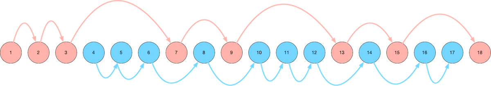

Title: How to Read Ulysses
Date: 2022-03-02 21:00
Category: Ulysses
Tags: reading, Ulysses, Joyce

[TOC]

A visual map of our route through *Ulysses*. Read on for an explanation...

## A Little Bit About Ulysses

Let's talk about [*Ulysses*](https://en.wikipedia.org/wiki/Ulysses_(novel)) for a minute.

*Ulysses* is regarded as one of the greatest books ever written. But, of course, it's also
barely comprehensible when you first read it.

Getting to know why *Ulysses* is so famous requires a lot of context, in the same way that understanding
what makes a film such a classic requires not just an appreciation of the aesthetics and the experience
of the film, but also the historical, social, and cultural context, the story surrounding the story.

The best way we can describe *Ulysses* is saying that it is a meta-novel. It is a novel that is nominally about
June 16, 1904, and how the two main characters spend that day - but throughout the story, there are so many more layers
that are added on - linguistics, art, language, history all make their appearances (as does just about every
major bodily function).

The novel is meta in the way that it weaves together layer upon layer of storytelling and narrative tehnique,
aping so many different styles (newspaper headings, Old English legends, Irish mythology, vignettes that
have the feel of a short indie film, even FAQs).

## How We Read Ulysses

Our first time reading through Ulysses was in 2011, (ironically) as a way of taking a mental break from
the stress of school. We had a special affinity for Joyce based on reading his short story collection
*Dubliners*, so making it through *Ulysses* was a goal we had had for a while.

Almost immediately, it was clear that this was not a book that could simple be "read", start to finish,
the way a normal book is read. No, *Ulysses* had more in common with a physics textbook than it did with
your typical novel. It is a thing to be experienced and studied, and taken slowly.

We spent the first three chapters of *Ulysses* extremely confused and without any hope of finishing the novel.
But then, we discovered two game-changing strategies:

**First**, we consulted books about *Ulysses*. Visit any academic library and you'll likely find an entire shelf of
books on *Ulysses*, but there are a few that are considered classics. One of the works that is considered a
definitive interpretation of *Ulysses* was written by Stuart Gilbert, who published his commentary on *Ulysses* in 1930.
Gilbert knew Joyce personally, lending an air of officiality to the interpretation. The commentary includes a chapter-by-chapter 
discussion of themes, images, symbols, callbacks to Homer's *Odyssey*, and key quotes to help make certain
passages of *Ulysses* stand out in the mind much more clearly. This book gave us the road map to each chapter
of *Ulysses*, and crucially, helped us realize that the chapters don't need to be read in linear order - there
are many converging and diverging timelines in *Ulysses* and there are many routes through the book.

**Second**, we discovered a wonderful audiobook version of *Ulysses* from Naxos audiobooks. (We started with Librivox
recordings, which were very hit-and-miss. Professionally-produced audiobooks are a cut above, and well worth 
seeking out.)

When we discovered audiobooks, we sometimes listened to the audio book version of the *Ulysses* chapter by itself,
and sometimes we read along with the audio recording. Either way, it's a very different way to experience a book,
to hear it read aloud, and doubly so with *Ulysses*, which has many sections that seem to take on a completely
different tone and life when they are read aloud versus read off of the page.

## Two Parallel Routes Through Ulysses

As we got to know *Ulysses* better, we gravitated toward Leopold Bloom's character. In particular,
we charted two different routes through the book - the first (mostly) following Leopold Bloom, and
the second following Stephen Dedalus. Here's a visual guide to our map to reading *Ulysses*:

We start with the blue route, which means the first few chapters of *Ulysses* that we read are
Chapters 4, 5, and 6. This is out of order, but the important thing is *enjoying* the experience
of reading *Ulysses* - and Chapters 4, 5, and 6 are far more enjoyable and comprehensible than
Chapters 1, 2, and 3.

### The Blue Route

The Blue Route through *Ulysses* (the first route that we take when we read it)
consists of the following chapters:

* [Chapter 4 - Calypso](https://charlesreid1.com/wiki/Ulysses/Calypso)
* [Chapter 5 - Lotus Eaters](https://charlesreid1.com/wiki/Ulysses/Lotus_Eaters)
* [Chapter 6 - Hades](https://charlesreid1.com/wiki/Ulysses/Hades)
* [Chapter 8 - Lestrygonians](https://charlesreid1.com/wiki/Ulysses/Lestrygonians)
* [Chapter 10 - Wandering Rocks](https://charlesreid1.com/wiki/Ulysses/Wandering_Rocks)
* [Chapter 11 - Sirens](https://charlesreid1.com/wiki/Ulysses/Sirens)
* [Chapter 12 - Cyclops](https://charlesreid1.com/wiki/Ulysses/Cyclops)
* [Chapter 14 - Oxen of the Sun](https://charlesreid1.com/wiki/Ulysses/Oxen_of_the_Sun)
* [Chapter 16 - Eumaeus](https://charlesreid1.com/wiki/Ulysses/Eumaeus)
* [Chapter 17 - Ithaca](https://charlesreid1.com/wiki/Ulysses/Ithaca)

This route follows Bloom from the start of his day (Chapter 4), follows him as he wanders
about town in the morning (Chapter 5), attends a funeral (Chapter 6), eats lunch (Chapter 8),
visits a pub in the afternoon (Chapter 12), and visits a hospital in the evening (Chapter 14).

The two main characters, Stephen Dedalus and Leopold Bloom, finally meet in Chapter 14, so
Chapters 16 and 17 cover the drunken evening and long path back home that the two take.

Chapter 17 is an absolute delight and takes the cake as our favorite chapter. It takes the form
of an FAQ, and reads almost like a technical specification for some omnipotent entity that will
one day need to reproduce, from scratch, every detail of the scenes depicted in Chapter 17.

Taken on its own, the Blue Path may leave out "notable" or "significant" chapters of *Ulysses*,
but the selection is lighter and more enjoyable than reading the novel start to finish.

One curious aspect of the Blue Path (perhaps true of the novel in general, though) is the way the
chapters seem to balloon in size, and sometimes in complexity. For example, Chapters 4, 5, 6, and 8
are similar in style, yet Chapter 4 is far shorter than Chapter 8; by the time the novel reaches Chapter 8
the narrative begins to wander a great deal, the stream of consciousness grows thicker and more
complicated with each page, the narrative captures ever more goings-on, and time seems to stretch and
dilate as the novel progresses.

(The novel's longest chapter, Chapter 15, comes near the end of the Red Path.)

Regarding the way the Blue and Red Paths read the novel out of order - one of the things that makes
it so easy to read *Ulysses* out of order is the nebulous nature of cross-references in the book.
You could read the entire novel backwards and probably find the same structure of references as if
you were reading it forward. Chapter 8 references Chaper 14, Chpater 12 references Chapter 8, then 14,
then 11, 5 references 3, 14 references everyone, and so on. Certain themes, words, motifs, and images
recur through the book, like cycles.

*Ulysses* must be pieced together, and read many times. Whatever order you read it in, reading the text
is like scouring for clues in a crime scene, except it's a perfectly-preserved crime scene that yields
infinite clues. The deeper you dig, the more clues you find, the more intricate the weaved web becomes.

The Blue Path makes *Ulysses* lighter, easier, and more digestible. If you only finish the Blue Route,
it's an accomplishment all in itself!

### The Red Route

The Red Route through *Ulysses* (the second route that we take through the book)
consists of the following chapters:

* [Chapter 1 - Telemachus](https://charlesreid1.com/wiki/Ulysses/Telemachus)
* [Chapter 2 - Nestor](https://charlesreid1.com/wiki/Ulysses/Nestor)
* [Chapter 3 - Proteus](https://charlesreid1.com/wiki/Ulysses/Proteus)
* [Chapter 7 - Aeolus](https://charlesreid1.com/wiki/Ulysses/Aeolus)
* [Chapter 9 - Scylla and Charybdis](https://charlesreid1.com/wiki/Ulysses/Scylla_and_Cherybdis)
* [Chapter 13 - Nausicaa](https://charlesreid1.com/wiki/Ulysses/Nausicaa)
* [Chapter 15 - Circe](https://charlesreid1.com/wiki/Ulysses/Circe)
* [Chapter 18 - Penelope](https://charlesreid1.com/wiki/Ulysses/Penelope)

The Red Route through the novel mainly follows Stephen Dedalus (with the exception of Chapter 7 (Aeolus), but it 
links up with Chapter 9 (Scylla and Charybdis)). Be warned, the Red Route chapters start off easy with Chapters 1 and 2,
but Chapter 3 (Proteus) feels like intellectual quicksand, and is a significant hurdle to getting through the novel
(hence its inclusion in the Red Path).

Chapter 3 is difficult because it's a rambling stream of consciousness from Stephen Dedalus, who is
a lot more intellectual (professorial) and abstract than Leopold Bloom. It makes Chapter 3 one of the more 
difficult chapters in *Ulysses*. But after taking the entire Blue Path through the novel, Chapter 3 is easier
to handle - the stream of consciousness format is familiar, but more abstract than the streams of consciousness
we saw from Leopold Bloom. Being familiar with the stream of consciousness format makes it easier to wade through
the generous heaping of historical, literary, and linguistic references in Chapter 3.

(Side note: Chapter 3 is when we first discovered the wonder of asking the library for help understanding
what the hell is going on in *Ulysses*. It turns out, a lot of people have a lot to say, and the last thing
anyone should do is get frustrated trying to make it through Chapter 3 by themselves!)

Chapter 7 (Aeolus) is left out of the Blue Path because its format of newspaper-like headlines and paragraphs
is a significant break from the stream of consciousness format of Chapters 4, 5, 6, and 8.

Chapter 9 is like the scene in the movie when we think the two storylines are finally going to converge,
except it turns out to be a near-miss, and the storylines remain separate. Bloom visits the library to 
retrieve a picture of two keys for an advertisement he's placing in the newspaper (for a client) in Chapter 7,
while Stephen is holding forth on Shakespeare in a discussion at the same library.

Chapter 13 is the infamous chapter that got *Ulysses* banned for its stream of consciousness description 
of Bloom getting his jollies off while watching fireworks at the beach. Another deviation of the Red Path
back to Bloom, but we think Chapter 13 is better appreciated after going through the Blue Path - especially
after Chapter 14.

Chapter 15 is, hands down, the single most difficult chapter of *Ulysses*, but also the richest.
Chapter 15 is best experienced by not reading it start-to-finish, not reading it off the page, but by
hearing it, by visualizing it. The less you read Chapter 15 like a novel, the more you get out of it.

Chapter 18 is the perfect way to end the book. Reading Chapter 18 at the end of the Red Path is like
finishing a long, excruciating, multi-day excursion through the woods by sitting beside a babbling brook,
peeling off your socks, and sticking your feet in the stream to soak for an hour or two.

And that's it - that's my recommended path through *Ulysses* in a nutshell.

## More Resources

Notes on *Ulysses* on our charlesreid1.com wiki: <https://charlesreid1.com/wiki/Ulysses>

Notes from our (very first) 2011 reading of *Ulysses*: <https://charlesreid1.com/wiki/Ulysses/2011>

Notes from our 2016 reading of *Ulysses* (the first year we charted the Blue Path and the Red Path): <https://charlesreid1.com/wiki/Ulysses/2016>

Notes from our (current) 2022 reading of *Ulysses*: <https://charlesreid1.com/wiki/Ulysses/2022>

## Happy 100th Birthday, Ulysses!

A very happy (belated) 100th birthday to one of the greatest novels of all time,
if only measuring by the enjoyment that we have extracted from this 
novel-puzzle-enigma-slash-undefinable-book-thing.

*Ulysses* was first published on February 2, 1922, a little over 100 years ago today.

We think the Wikipedia article for *Ulysses* sums it up best:

> The publication history of Ulysses is complex.
> 
> - https://en.wikipedia.org/wiki/Ulysses_(novel)#Publication_history

