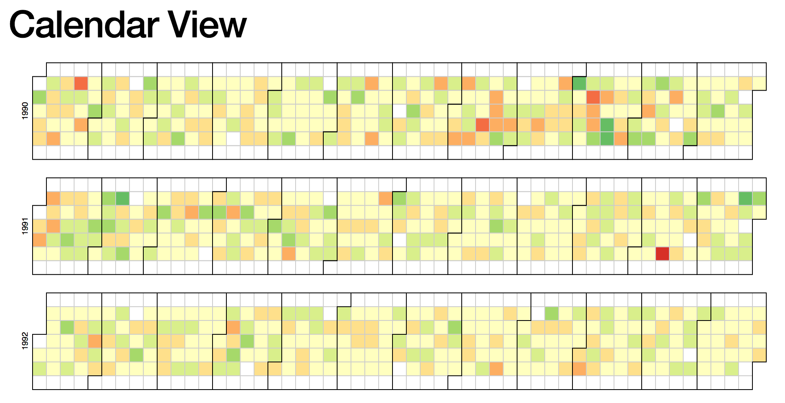
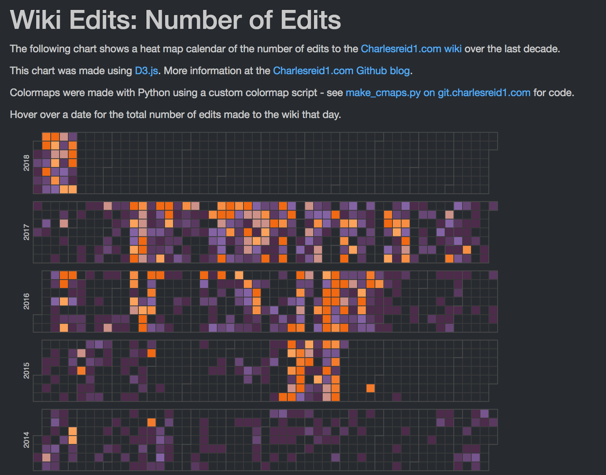
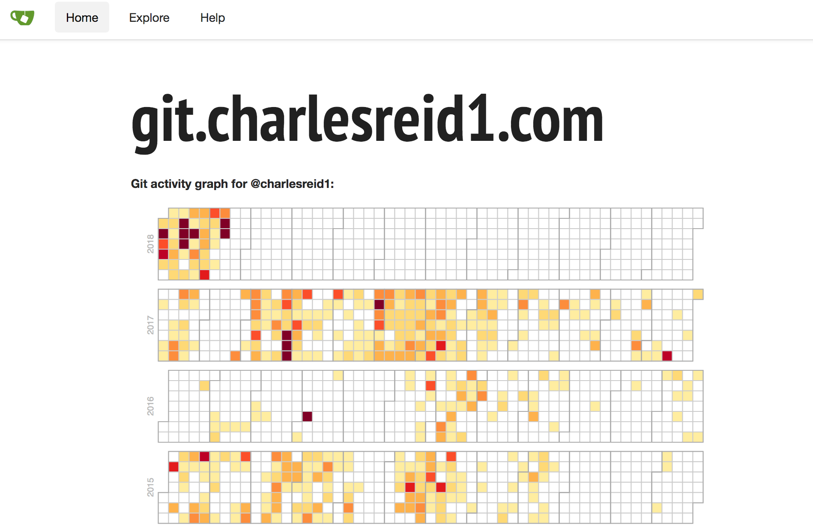

Title: D3 Calendar Visualizations
Date: 2018-02-16 23:00
Category: Javascript
Tags: javascript, d3, computer science, python, colors

# Table of Contents

* [Starting example](#cal-starting)
* [What needs to be changed](#cal-changed)
* [Formatting the data](#cal-data)
    * [MediaWiki edits](#cal-data-mediawiki)
    * [Git commits](#cal-data-git)
* [Creating the color map](#cal-colormap)
* [How the calendar code works](#cal-code)
* [Final result](#cal-final)

<br />
<br />

<a name="cal-starting"></a>
# Starting example

Let's begin with a D3 example. Mike Bostock provided a [Calendar View](https://bl.ocks.org/mbostock/4063318)
block illustrating how to draw a very interesting visualization of
large amounts of data over time:

<a href="https://bl.ocks.org/mbostock/4063318">

</a>

You might recognize this type of graph from Github, whose activity graph
shows the same visualization.

The data shown in this example consists of several years of stock market data.
It is a simple but very large data set, with each data poit consisting of one date 
and one number (the percentage gain or loss).

The example also shows how to perform a simple calculation from multiple fields
of the data to plot a derived quantity. In this case, the data consists of a 
high, low, and close, and the quantity being plotted is the percent change:

$$
\mbox{% Change} = \dfrac{\mbox{Close} - \mbox{Open} }{\mbox{Open}}
$$

<a name="cal-changed"></a>
# What needs to be changed

To change this calendar visualization to visualize our own data, we need to change two things:

* The data set being visualized
* The color map being used

We can leave the rest alone, or make small modifications as needed. Fortunately, these changes
are straightforward to make for the calendar visualization.

<a name="cal-data"></a>
# Formatting the data

To modify the calendar graph for our own data, we'll output data as a time series: 
one column of date/time stamps, and another column of data to plot.

Let's take a look at the [original data](https://bl.ocks.org/mbostock/raw/4063318/dji.csv):

```plain
Date,Open,High,Low,Close,Volume,Adj Close
2010-10-01,10789.72,10907.41,10759.14,10829.68,4298910000,10829.68
2010-09-30,10835.96,10960.99,10732.27,10788.05,4284160000,10788.05
2010-09-29,10857.98,10901.96,10759.75,10835.28,3990280000,10835.28
2010-09-28,10809.85,10905.44,10714.03,10858.14,4025840000,10858.14
2010-09-27,10860.03,10902.52,10776.44,10812.04,3587860000,10812.04
```

In the code, we can see where this data is actually being parsed:

```javascript
  var data = d3.nest()
      .key(function(d) { return d.Date; })
      .rollup(function(d) { return (d[0].Close - d[0].Open) / d[0].Open; })
      .object(csv);
```

So, to modify this to suit our own custom data set, we can output our data as:

```plain
date,series1series2
2010-10-01,1,150
2010-10-02,2,250
2010-10-03,3,350
```

and change the data parsing code to:

```javascript
  var data = d3.nest()
      .key(function(d) { return d.date; })
      .rollup(function(d) { 
            // Change this depending on what you want to plot
            return d[0].series1; 
      })
      .object(csv);
```

Next, we discuss a few interesting applications of this visualization technique
and how to generate the data sets.

<a name="cal-data-mediawiki"></a>
## MediaWiki Edits

One of the applications of interest was scraping a MediaWiki wiki
([charlesreid1.com/wiki](https://charlesreid1.com/wiki) to be precise)
to determine the number of edits made to the wiki on a given date.

Fortunately, MediaWiki provides a rich API for interacting with 
wikis programmatically, and one of the best packages for doing it 
is [pywikibot](https://github.com/wikimedia/pywikibot).

The way we compiled the data set for visualization was to scrape
page histories for every page on the wiki, creating one observation
for each edit on each page, and agglomerate the edits for each day
into a final count.

The schema used was:

* `_id` - sha1 of text
* `title` - title of article
* `timestamp` - timestamp of edit
* `count` - number of characters in edit

The pseudocode used to extract the page edits was:

```plain
    get pages generator
    for page in pages:
        get page revisions generator
        for revision in page revisions:
            drop old doc from database
            insert new doc into database
            update record 
```

Finally, a bit of pywikibot code:

```python
    # Get the site
    site = get_site()

    # Get the iterator returning pages to process
    page_generator = get_page_generator(site, N)

    # Run the algorithm:
    for page in page_generator:

        page_title = page.title()

        print("Now parsing page: %s"%(page_title))

        rev_generator = page.revisions(content=count_chars)

        for rev in rev_generator:

            # Assemble the NoSQL document
            doc = {}
            doc['_id'] = rev.sha1
            doc['title'] = page_title
            doc['timestamp'] = rev.timestamp
            doc['count'] = len(rev.text)

            # Insert the new NoSQL document
            page_history_collection.insert_one(doc)
```

The mechanisms to obtain the page generator

```python
def get_site():
    """Get the Site object representing charlesreid1.com
    """
    return pywikibot.Site()

def get_page_generator(s,max_items=0):
    """Get the generator that returns the Page objects 
    that we're interested in, from Site s.
    """
    page_generator = s.allpages()
    if(max_items>0):
        page_generator.set_maximum_items(max_items)
    return page_generator
```

Note that pywikibot will already have the site configured
once you run the login script. For more information about
how to log in to a wiki with Pybot, and general information
about Pywikibot tasks, see the [Pywikibot page](https://charlesreid1.com/wiki/Pywikibot)
on the charlesreid1.com wiki.

<a name="cal-data-git"></a>
## Git Commits

Another application of these types of calendars comes directly
from Github's visualization of the number of commits made by a 
user on each day.

To extract this information, you will need a folder full of git repositories,
which will allow you to use git status to extract commit information from the 
log of each repository and assemble it all into a time series for a calendar.

While there is a Python package for interfacing with the git API, git itself
is extremely powerful and is capable of doing this just fine. We use 
Python's subprocess library to make a call to git status, and parse the 
results into a data structure for exporting to CSV.

Here is the code that was used to walk through each directory
and extract information from a git status command:

```python
import subprocess
from glob import glob
import os, re
import pandas as pd
import datetime


[clipped]


    df = pd.DataFrame()
    orgs = glob(root_dir+"/repositories/*")
    for org in orgs:
        base_org = os.path.basename(org)
        repos = glob(org+"/*")
        for repo in repos:

            # Print out the org and repo name
            base_repo = re.sub('.git','', os.path.basename(repo))
            log_file = base_org + "." + base_repo + ".log"
            print("%s : %s"%(base_org,base_repo))

            # Get each commit
            with open(status_dir + "/" + log_file, 'r', encoding="ISO-8859-1") as f:
                lines = f.readlines()

            for line in lines:
                tokens = line.split(" ")
                commit_id = tokens[0]
                date = tokens[1]
                time = tokens[2]
                msg = tokens[4:]

                df = df.append( 
                                dict(   
                                        commit_id = tokens[0],
                                        date = tokens[1],
                                        time = tokens[2],
                                        commits = 1,
                                        msg = " ".join(msg)
                                     ),
                                ignore_index=True
                                )

    ag = df.groupby(['date']).agg({'commits':sum})
    ag['commits'] = ag['commits'].apply(int)
    ag.to_csv('commit_counts.csv')
```

The last bit of code groups each commit by date, applying the
sum function to the number of commits (1 for each commit), 
to yield the total number of commits for each date:

```
date,commits
2014-01-17,2
2014-03-26,11
2014-03-28,3
2014-04-01,4
2014-04-02,10
2014-04-03,4
2014-04-04,3
```

<a name="cal-colormap"></a>
# Creating the color map

The best part of the process is picking a color map for the calendar.
The [ColorBrewer](http://colorbrewer2.org/#type=sequential&scheme=OrRd&n=7)
site has some good color palettes inspired by cartographic color needs.
Python also provides some useful libraries and functionality for 
generating colormaps.

There are a number of options:

* [Matplotlib colormaps](https://matplotlib.org/users/colormaps.html)
* [Bokeh colorcet](https://bokeh.github.io/colorcet/)
* [Ocean colormaps: cmocean](https://matplotlib.org/cmocean/)

Here, we'll cover an alternative approach:
defining a colormap that linearly interpolates
between colors at particular locations on the 
interval 0 to 1.

We will also use the [webcolors](https://github.com/ubernostrum/webcolors) 
module in Python to convert between colors in 
various formats, and a function `make_cmap()`
available from [Chris Slocum](http://schubert.atmos.colostate.edu/~cslocum/code/custom_cmap.py):

[Link to `make_cmap.py`](https://charlesreid1.com:3000/d3/charlesreid1-calendar/src/master/make_cmaps.py)

**make_cmap.py:**

```python
def make_cmap(colors, position=None, bit=False):
    '''
    make_cmap takes a list of tuples which contain RGB values. The RGB
    values may either be in 8-bit [0 to 255] (in which bit must be set to
    True when called) or arithmetic [0 to 1] (default). make_cmap returns
    a cmap with equally spaced colors.
    Arrange your tuples so that the first color is the lowest value for the
    colorbar and the last is the highest.
    position contains values from 0 to 1 to dictate the location of each color.
    '''
    import matplotlib as mpl
    import numpy as np
    bit_rgb = np.linspace(0,1,256)
    if position == None:
        position = np.linspace(0,1,len(colors))
    else:
        if len(position) != len(colors):
            sys.exit("position length must be the same as colors")
        elif position[0] != 0 or position[-1] != 1:
            sys.exit("position must start with 0 and end with 1")
    if bit:
        for i in range(len(colors)):
            colors[i] = (bit_rgb[colors[i][0]],
                         bit_rgb[colors[i][1]],
                         bit_rgb[colors[i][2]])
    cdict = {'red':[], 'green':[], 'blue':[]}
    for pos, color in zip(position, colors):
        cdict['red'].append((pos, color[0], color[0]))
        cdict['green'].append((pos, color[1], color[1]))
        cdict['blue'].append((pos, color[2], color[2]))

    cmap = mpl.colors.LinearSegmentedColormap('my_colormap',cdict,256)
    return cmap
```

Now, an example of how we can call this function: 
this code creates a colormap ranging from purple to orange.

```python
def purple_to_orange():
    """Dark purple to bright orange."""

    start_hex = "#4d2b4b"
    mid1_hex  = "#8c6bb1"
    mid2_hex  = "#fdae6b"
    end_hex   = "#f16913"

    start_color = [j/255 for j in webcolors.hex_to_rgb(start_hex)]
    mid1_color   = [j/255 for j in webcolors.hex_to_rgb(mid1_hex)]
    mid2_color   = [j/255 for j in webcolors.hex_to_rgb(mid2_hex)]
    end_color   = [j/255 for j in webcolors.hex_to_rgb(end_hex)]

    colors = [start_color, mid1_color, mid2_color, end_color]
    position = [0, 0.5, 0.6, 1]
    cm = make_cmap(colors, position=position)
```

Now, the following code will evaluate the colormap to create
9 separate hex colors:

```python
    # Now just call cm(0.0) thru cm(1.0)
    N = 9
    hex_colorz = []
    for i in range(N+1):
        x = i/N
        rgbd_color = cm(x)[0:3]
        rgb_color = [int(c*255) for c in rgbd_color]
        hex_color = webcolors.rgb_to_hex(rgb_color)
        hex_colorz.append(hex_color)

    print(hex_colorz)
```

<a name="cal-code"></a>
# How the calendar code works

Start with the HTML document: 

```html
<!DOCTYPE html>
<body style="background: #272b30;">
<div id="calendar"></div>
<script src="https://d3js.org/d3.v4.min.js"></script>
<script>
/* D3 code goes here */
</script>
</body>
```

Next, the Javascript code that creates the calendar
visualization. We'll walk through each part.

```javascript
var width = 700,
    height = 90,
    cellSize = 12;

// big integers
var formatStuff = d3.format(",");

/*
TEH COLORRRZZZZ
*/
var realBackgroundColor = "#272b30";
var tileBackgroundColor = realBackgroundColor;//"#3a3a3a";
var tileStrokeColor     = "#3a3a3a";
var monthStrokeColor    = "#4a4a4a";

var color = d3.scaleQuantize()
    .domain([0, 60])
    .range(["#4d2b4b","#5a3961","#684777","#77558f","#8463a5","#cc9189","#fba25c","#f78e43","#f47b2b","#f16913"]);
// purple orange
```

The canvas goes on the div tag with id `calendar`:

```javascript
/*
Make the canvas
*/
var svg = d3.select("div#calendar")
  .selectAll("svg")
  .data(d3.range(2010, 2019).reverse())
  .enter().append("svg")
    .attr("width", width)
    .attr("height", height)
  .append("g")
    .attr("transform", "translate(" + ((width - cellSize * 53) / 2) + "," + (height - cellSize * 7 - 1) + ")");


/*
Write the years
*/
svg.append("text")
    .attr("transform", "translate(-6," + cellSize * 3.5 + ")rotate(-90)")
    .attr("font-family", "sans-serif")
    .attr("font-size", 10)
    .attr("fill", "#bbb")
    .attr("text-anchor", "middle")
    .text(function(d) { return d; });
```

The next two portions are the meat of the calendar visualization,
drawing the tiles and outlines:

```javascript
/*
Draw the tiles representing days of the year
(also draw tile outlines)
*/
var rect = svg.append("g")
    .attr("fill",   tileBackgroundColor)
    .attr("stroke", tileStrokeColor)
  .selectAll("rect")
  .data(function(d) { return d3.timeDays(new Date(d, 0, 1), new Date(d + 1, 0, 1)); })
  .enter().append("rect")
    .attr("width", cellSize)
    .attr("height", cellSize)
    .attr("x", function(d) { return d3.timeWeek.count(d3.timeYear(d), d) * cellSize; })
    .attr("y", function(d) { return d.getDay() * cellSize; })
    .datum(d3.timeFormat("%Y-%m-%d"));


/*
Draw outlines of groups representing months
*/
svg.append("g")
    .attr("fill", "none")
    .attr("stroke", monthStrokeColor)
  .selectAll("path")
  .data(function(d) { return d3.timeMonths(new Date(d, 0, 1), new Date(d + 1, 0, 1)); })
  .enter().append("path")
    .attr("d", pathMonth);
```

Now, the code that loads the data, filters it, performs any calculations,
and draws colored rectangles on top of the baseline square grid:

```
/*
Load up the csv file
*/
d3.csv("page_edits.csv", function(error, csv) {
  if (error) throw error;

  /*
  This is where you decide what values to plot
  */
  var data = d3.nest()
        .key(function(d) { return d.timestamp ; })
        .rollup(function(d) { 
            return d[0].edits; 
        })
        .object(csv);

  rect.filter(function(d) { return d in data; })
        .attr("fill", function(d) { return color(data[d]); })
        .append("title")
        .text(function(d) { return d + ": " + formatStuff(data[d]); });
});
```

Finally, the most mysterious bit of magic in this code is 
the code that draws the squares around the months.
This has to use the coordinates of the beginning and end 
of the months to draw a complicated square path. 

It's magic, it works, we're happy.

```javascript
function pathMonth(t0) {
  var t1 = new Date(t0.getFullYear(), t0.getMonth() + 1, 0),
      d0 = t0.getDay(), w0 = d3.timeWeek.count(d3.timeYear(t0), t0),
      d1 = t1.getDay(), w1 = d3.timeWeek.count(d3.timeYear(t1), t1);
  return "M" + (w0 + 1) * cellSize + "," + d0 * cellSize
      + "H" + w0 * cellSize + "V" + 7 * cellSize
      + "H" + w1 * cellSize + "V" + (d1 + 1) * cellSize
      + "H" + (w1 + 1) * cellSize + "V" + 0
      + "H" + (w0 + 1) * cellSize + "Z";
}
```

<a name="cal-final"></a>
# Final result

The finished product, visualizing edits to [charlesreid1.com/wiki/](https://charlesreid1.com/wiki/)
and commits to [git.charlesreid1.com](http://git.charlesreid1.com),
can be seen at the following links:

* Wiki edits calendar: [https://charlesreid1.com/wiki_calendar](https://charlesreid1.com/wiki_calendar)
* Git commits calendar: [https://git.charlesreid1.com](https://git.charlesreid1.com)

<a href="https://charlesreid1.com/wiki_calendar">

</a>

<a href="http://git.charlesreid1.com/">

</a>

