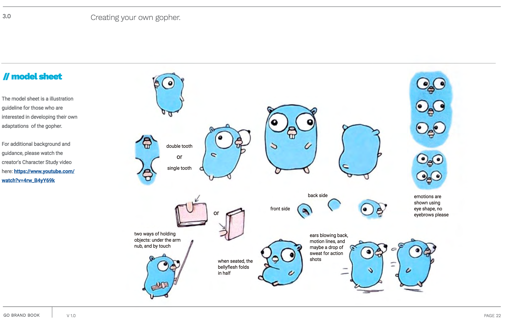

Title: Any Color You Like, As Long As It's 00ADD8
Date: 2019-02-23 10:00
Category: Go
Tags: go, golang, rosalind, bioinformatics, black, python, gofmt

A short post with some thoughts on how writing Go code has
helped me learn to stop worrying and love auto-formatting tools.

Go code is terse. Not Python-terse, but terse. And unlike Java, 
you don't find yourself constantly resorting to the security
blanket of objects - something that Python (mercifully) can 
go either way on.

I used Java when I taught computer science at South Seattle College,
and remember telling students once that one day, students taking
CSC 142/143 would be using Go instead of Java. These days, I'm not
as certain of that, but given that Go's strengths are asynchronous
programming (critical for taking advantage of multicore hardware) 
and tasks suited for the web, it isn't hard to imagine a "Go 2.0"
that becomes a de-facto standard in school curricula.

Something else I like about Go is the way there is a toolchain that
adheres to the Unix tooling philosophy: do one thing and do it well.
Take `gofmt` as an example - this is a tool that autoformats
Go code to conform to the Go standard spec. `gofmt` is a simple tool
that does just one thing. This tool can be connected to various text
editors with hooks, a la [vimgo](https://github.com/fatih/vim-go).

`gofmt` has taught me the value, and convenience, of embracing 
the norms and standards set by a language's community. Go
recommends using tabs, for example, which early on I found
a bit repulsive. Before I had vimgo set up, I was stubbornly 
using spaces instead of tabs in my Go code.

But then I set up vimgo so that, every time I saved a buffer containing
Go code, it would run `gofmt` on the code, replacing all of the nitpicky
details (like how many spaces between parentheses and variables, or wether
`==` should be surrounded be spaces) and it just makes an executive decision.

Sure, it uses tabs instead of spaces, but once you start to work on
code and save it and you see all of these details just _handled_, 
you quickly learn not to worry about it.

And the surprising thing, to me, was just how much overhead I was spending
on those things. It adds up.

The `gofmt` executive decision strategy is similar to [black](https://github.com/ambv/black),
"The uncompromising Python code formatter," whose slogan
is "Any color you like, as long as it's black."

While I really like black and would love to let it handle all of my Python
code the way `gofmt` handles all of my Go code, the unfortunate reality is
that Python, unlike Go, does not have an official standard, and if you
automatically apply black formatting to all Python code, you can quickly
wreak havoc on version-controlled code. You have to tread more lightly
with black. I apply black more selectively by only applying it to `.py` 
files that are in specific project subdirectories.)

A slogan for `gofmt` could be, "Any color you like, as long as it's `#00ADD8`."

Wait, what? Where did `#00ADD8` come from?

It's in the [Go Brand Book](https://storage.googleapis.com/golang-assets/Go-brand-book-v1.9.5.pdf).
Prior to discovering this (the link was dropped in an unrelated
discussion on the [gonuts mailing list](https://golang.org/help/)),
I had no idea waht a brand book was. Turns out, this is very much
_a thing_ in marketing. Companies, projects, and organizations all
have brand books that lay out the details of their marketing designs,
branding, looks, everything down to the fonts and colors.

The Go brand book is short, but it does specify an official color
for Golang: `#00ADD8`. It also covers critical details about how to
depict the Go gopher, including the physics of gopher belly folds:

There are some other branding books - the 
[Coca Cola brand book](https://www.flipsnack.com/cardesigns/brandbook-cocacola.html).
is simultaneously fascinating and terrible,
in a late stage capitalism kind of way.

At any rate, at least the Go brand book is about something useful,
and contains silly things like gophers.

