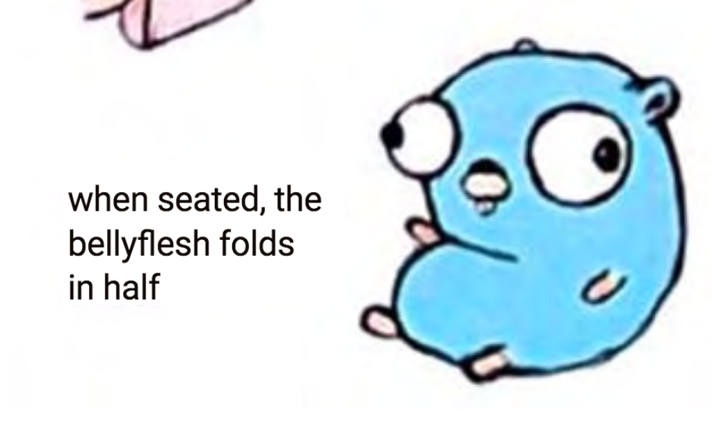

Title: Any Color You Like, As Long As It's 00ADD8
Date: 2019-02-23 10:00
Category: Go
Tags: go, golang, rosalind, bioinformatics, black, python, gofmt
Status: draft

A short post with some thoughts on how writing Go code has
helped us learn to stop worrying and love autoformatting tools.

Go code is terse - not as terse as Python, but not excessively 
verbose. There is a constant overhead spent implementing operations
that, in Python, are available through built-in standard library
functions (for example, `x in mylist`) or that would be easily
implemented in a single line with a Python list comprehension.
But overall it is an excellent language to learn.

Another thing about Go is that the tools supporting Go adhere
to the Unix tooling philosophy: do one thing and do it well.
Take `gofmt` as an example - this is a tool that autoformats
Go code to conform to the Go standard spec. It does not provide
a huge variety of options, or have a dozen flags, it is designed
to enforce the spec and that's exactly what it does.

`gofmt` has taught me the value, and convenience, of embracing 
the norms and standards set by a language's community. Go
recommends using tabs, for example, which early on we found
abhorrent. But by making appropriate changes to our `.vimrc`
file, we were able to configure `gofmt` to run on any `.go`
file when the buffer is saved, and to automatically switch 
how it treats tabs (default behavior is to insert 4 spaces
when the user presses tab, but in .go files it inserts a
tab character).

This is similar to the strategy employed by [black](https://github.com/ambv/black),
"The uncompromising Python code formatter," whose slogan
is "Any color you like, as long as it's black."

(Unfortunately, unlike with Go, where we're often writing greenfield code or
code that already conforms to the `gofmt` standard, and therefore
applying `gofmt` to every `.go` file by default doesn't lead to
many tiny changes all over the place, automatically applying black
to all Python files can wreak havoc on version-controlled Python
files, if you aren't careful. So, black is applied more
selectively by `.vimrc`, mainly lookinng for `.py` files that are
in specific project subdirectories.)

The slogan of `gofmt` could be, "Any color you like, as long as it's 
`#00ADD8`."

Where did we come up with that hex code? It's in the 
[Go Brand Book](https://storage.googleapis.com/golang-assets/Go-brand-book-v1.9.5.pdf).
We highly recommend checking out this curious and short document,
which covers details about logos, fonts, color schemas, and even
the dos and don'ts when drawing Go gophers, covering such important
details as how to indicate _action_, and the physics of gopher
belly folds.

Things I don't like about Go? So far, this is a mercifully short
list - versioning and package management is Go's biggest
weakness. Ensuring you have the right version of a package,
knowing which one is installed, etc., is difficult. 

This is a known major issue in Go, and steps have
already been taken toward resolving this in new
versions of Go, so we'll see where those, uh, go.

