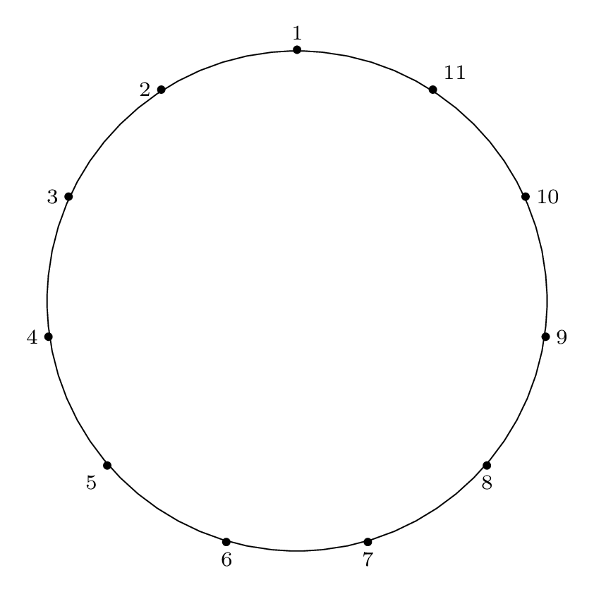

Title: The Josephus Problem: Part 3: Solving the Double Step Case with Algorithm D
Date: 2019-03-22 14:00
Category: Computer Science
Tags: graphs, puzzles, algorithms, josephus, latex

This is Part 3 of a four-part series.

* [The Josephus Problem: Part 1: The Problem](https://charlesreid1.github.io/the-josephus-problem-part-1-the-problem.html)
* [The Josephus Problem: Part 2: Two Examples](https://charlesreid1.github.io/the-josephus-problem-part-2-two-examples.html)
* [The Josephus Problem: Part 3: Solving the Double Step Case](https://charlesreid1.github.io/the-josephus-problem-part-3-solving-the-double-step-case.html)
* [The Josephus Problem: Part 4: Solving the General Case](#)

<br />
<br />

## Table of Contents

* [Solving the Double Step Case](#solving-the-double-step-case)
* [Algorithm D: Using Doubling Permutation](#algorithm-d-using-doubling-permutation)
    * [The Algorithm](#the-algorithm)
    * [Write the Doubling Permutation](#write-the-doubling-permutation)
    * [Table Method](#table-method)
    * [Reverse the Doubling Permutation](#reverse-the-doubling-permutation)
    * [Trim the Reversed Doubling Permutation](#trim-the-reversed-doubling-permutation)
* [Why Does Algorithm D Work?](#why-does-algorithm-d-work)
    * [An Important Observation](#an-important-observation)
    * [Three Facts](#three-facts)
    * [Power of Two Example](#power-of-two-example)
    * [Not a Power of Two Example](#not-a-power-of-two-example)
    * [The Power of Two Shortcut](#the-power-of-two-shortcut)
* [Summary](#summary)

<br />
<br />

## Solving the Double Step Case

The Josephus Problem for a step size of $m = 2$
can be solved two ways:

- Algorithm D: Doubling Permutation Algorithm
- Algorithm S: Label Skipped Nodes Algorithm

In this blog post we cover Algorithm D, which makes 
use of a doubling permutation. 

In the first section ([Algorithm D: Using Doubling Permutation](#algorithm-d-using-doubling-permutation))
we start by showing the recipe as applied 
to the case of $n = 11, m = 2$. 

The recipe is straightforward to apply, but it is not
at all clear how it works, so in the next section
([Why Does Algorithm D Work?](#why-does-algorithm-d-work))
we discuss some of the algorithm's inner workings
and explore the case of $n = 8, m = 2$ (a special
case where the circle size is a power of two) before
returning to the example of $n = 11, m = 2$.

We 

We start by covering Algorithm D, which makes
use of a doubling permutation, and explain how
Algorithm D works and why.

Covering Algorithm D will also reveal patterns
that will show up again in Algorithm S, which is
essentially a shortcut method for Algorithm D.

We will start with a concrete example of $n = 11, m = 2$
to illustrate Algorithm D, then walk through how it works.
We will also cover the case of $n = 8, m = 2$ for comparison,
since a circle size that is a power of two happens to be a
special case.


## Algorithm D: Using Doubling Permutation

In Exercise 29, Knuth asks a question that reveals
a solution procedure for the special case of $m = 2$,
and asks the reader to prove it:

> Prove: the cycle form of the Josephus permutation
> when $m = 2$ can be obtained by expressing 
> the "doubling permutation" of $\{1, 2, \dots, 2n\}$,
> which takes $j$ into $(2j) \mod (2n+1)$ into
> cycle form, then **reversing** L and R, 
> and erasing all numbers larger than $n$.

Fortunately, we don't have to work out the solution
procedure for ourselves; unfortunately, it is not 
at all obvious why the solution procedure works, so
once we have seen how to apply it, we have to do a
bit more work before we can understand it.

<br />
<br />

### The Algorithm

Given an input size $n$, the algorithm steps are:

1. Write the doubling permutation (in table form)

2. Factor the doubling permutation into cycles

3. Reverse each cycle and remove values larger than n

The result will be the Josephus permutation cycles.

<br />
<br />

### Write the Doubling Permutation

As mentioned above, we will start with the concrete example of
$n = 11, m = 2$.

We start by writing the doubling permutation for
the integers $1 \dots 2n$:

$$
\left( 1 \, 2 \, 4 \, 8 \, 16 \, 32 \, \dots \right)
$$

When a number is greater than $2n+1$, it is
reduced $\mod (2n+1)$, so the next few terms of the
doubling permutation written out and reduced modulo
$2n+1$ are:

$$
\left( 1 \, 2 \, 4 \, 8 \, 16 \, 32 \, 64 \, 128 \, 256 \, 512 \, 1024 \right)
$$

which reduces modulo $2n+1$ to:

$$
\left( 1 \, 2 \, 4 \, 8 \, 16 \, 9  \, 18 \,  13 \,   3 \, 6\, 12 \right)
$$

After 12, we reach 1 again, the starting value, so further 
doublings will result in repetition of the elements we have
so far. 

Next, continue the process with the remaining elements.
Start with the smallest element not included in the 
cycle found above, which is 5, and continue the operation
of doubling and reducing modulo $2n+1$. Doing this results in
the terms:

$$
\left( 5 \, 10 \, 20 \, 40 \, 80 \, \dots \right)
$$

which reduces modulo $2n+1$ to:

$$
\left( 5 \, 10 \, 20 \, 17 \, 11 \, \dots \right)
$$

Repeating this until the first element repeats
yields all of the remaining elements:

$$
\left( 5 \, 10 \, 20 \, 17 \, 11 \, 22 \, 21 \, 19 \, 15 \, 7 \, 14 \right)
$$

Now the final doubling permutation can be written as the 
product of the two cycles:

$$
\left( 1 \, 2 \, 4 \, 8 \, 16 \, 9  \, 18 \,  13 \,   3 \, 6\, 12 \right)
\left( 5 \, 10 \, 20 \, 17 \, 11 \, 22 \, 21 \, 19 \, 15 \, 7 \, 14 \right)
$$

We now have the cycles of the doubling permutation! Step 2 finished.

### Table Method

Slightly more convenient than writing out the cycles the way we did above
is to create a table, with a column for $j = 1 \dots 2n$, a column for
$2j$, and a column for $(2j) \mod (2n+1)$.

```
 j   |  2j  |  2j mod 2n+1
-----|------|---------------
  1  |   2  |        2
  2  |   4  |        4
  3  |   6  |        6
  4  |   8  |        8
  5  |  10  |       10
  6  |  12  |       12
  7  |  14  |       14
  8  |  16  |       16
  9  |  18  |       18
 10  |  20  |       20
 11  |  22  |       22
 12  |  24  |        1
 13  |  26  |        3
 14  |  28  |        5
 15  |  30  |        7
 16  |  32  |        9
 17  |  34  |       11
 18  |  36  |       13
 19  |  38  |       15
 20  |  40  |       17
 21  |  42  |       19
 22  |  44  |       21
```

Now the cycles can be constructed by starting with the $j$ column of the 
first row in the table (1), reading off the corresponding entry (2) in the 
$(2j) \mod (2n+1)$ column, adding the pair $1 \rightarrow 2$ to the cycle,
and moving to the row of the table with that corresponding $j$ value.

The next step takes us to row 2 of the table, where we read off the value 4
from the right column, add the pair $2 \rightarrow 4$ to the cycle, and keep
moving.

Eventually, the procedure will complete the first cycle and take us back to 1.
Since there are still rows in the table left, repeat the procedure, starting
with the first available row of the table (5), and keep going until all entries
of the table are gone. This will yield the same cycles as the process described 
above, but the bookkeeping is slightly easier:

$$
\left( 1 \, 2 \, 4 \, 8 \, 16 \, 9  \, 18 \,  13 \,   3 \, 6\, 12 \right)
\left( 5 \, 10 \, 20 \, 17 \, 11 \, 22 \, 21 \, 19 \, 15 \, 7 \, 14 \right)
$$


### Reverse the Doubling Permutation

The next step is to reverse the permutation from left to right,
which means we step through all cycles from left to right,
and step through each cycle from left to right.

Starting with the doubling permutation:

$$
\left( 1 \, 2 \, 4 \, 8 \, 16 \, 9  \, 18 \,  13 \,   3 \, 6\, 12 \right)
\left( 5 \, 10 \, 20 \, 17 \, 11 \, 22 \, 21 \, 19 \, 15 \, 7 \, 14 \right)
$$

We obtain the reverse:

$$
\left( 14 \, 7 \, 15 \, 19 \, 21 \, 22 \, 11 \, 17 \, 20 \, 10 \, 5 \right)
\left( 12 \, 6 \, 3 \, 13 \, 18 \, 9 \, 16 \, 8 \, 4 \, 2 \, 1 \right)
$$


### Trim the Reversed Doubling Permutation

Now we eliminate any numbers from the reversed doubling permutation
that are larger than $n = 11$, to get the trimmed permutation:

$$
\left( 7 \, 11 \, 10 \, 5 \right)
\left( 6 \, 3 \, 9 \, 8 \, 4 \, 2 \, 1 \right)
$$

This is the final Josephus permutation. The one remaining step is to
rewrite the cycles in standard "sorted" order:

$$
\left( 1 \, 6 \, 3 \, 9 \, 8 \, 4 \, 2 \right)
\left( 5 \, 7 \, 11 \, 10 \right)
$$

Congratulations! You just solved the problem.


-----


## Why Does Algorithm D Work?

If at this point you are scratching your head in wonder
at the seeming black magic involved in this algorithm,
then welcome to <u>The Art of Computer Programming</u>!
(Seriously, the exercises are chock full of questions
like this one.)

To understand why Algorithm D works, it is instructive
to consider a case where $n$ is a power of two, and make
some observations and generalizations to uncover the pattern
at work in Algorithm D. 


### An Important Observation

Start with an important observation: each time we complete one 
circuit of the circle, we have reduced the number of items 
in the circle by 

$$
\left\lfloor{ \frac{n}{2} }\right\rfloor
$$

If our circle size is even, that means we cut our circle
size in half each time through the circle.

The halving operation means the Josephus problem is
intimately linked with powers of 2 (or, base 2 logs),
so that's where the powers of 2 will come from.


### Three Facts

Now we use this observation about halving to
state 3 facts about the case:

<br />

**Fact 1: If we are considering an item at an odd-numbered
location in the circle, we have already been
through the circle at least once.**

(Explanation: The first time through the circle, 
all of the items in the circle at even-numbered 
locations will be removed, so only items at 
odd-numbered locations around the circle are left
after the first pass.)

<br />

**Fact 2: When the circle size is a power of 2,
the first item in the circle is the last item removed.**

(Explanation: If we have a circle the size of a power of 2,
we will always remove the last item in the circle when we
complete a circuit (because we will always reach it using 
two-steps), which means we always skip item 1 if the circle
size is a power of 2.)

(Addendum: If a circle size starts as a power of 2,
going through the circle once and removing elements will
exactly halve the circle size, and preserve the property
that the circle size is a power of 2.)

<br />

**Fact 3: When the circle size is not a power of 2, the
size will eventually be reduced to a power of 2. Then
the item at the starting position in that round will be
the last item removed.**

(Explanation: Combining Fact 1 and Fact 2, we can see
that eventually we will always reach the special case
of the circle size being a power of 2, since with each
step, we reduce the circle size by 1. For example,
for a circle size of 22, we must carry out 6 removal
operations to reach a circle size of 16, at which point
the item at the starting position will be the last item
to be removed from the circle.)

<br />

Now we will use these 3 facts to understand Algorithm D.

### Power of Two Example

Let's run through a Josephus solution for an example
where $n$ is a power of two, specifically, $n = 8, m = 2$.

We start by creating the doubling permutation table,
with columns for $j$, $2j$, and $(2j) \mod (2n+1)$:

```
 j   |  2j  |  2j mod 2n+1
-----|------|---------------
  1  |   2  |        2
  2  |   4  |        4
  3  |   6  |        6
  4  |   8  |        8
  5  |  10  |       10
  6  |  12  |       12
  7  |  14  |       14
  8  |  16  |       16
  9  |  18  |        1
 10  |  20  |        3
 11  |  22  |        5
 12  |  24  |        7
 13  |  26  |        9
 14  |  28  |       11
 15  |  30  |       13
 16  |  32  |       15
```

The variable $j$ takes on $2n$ values, 
$j = 1 \dots 2n$, each of which
are doubled and reduced modulo $2n+1$.

From column 3 we can see why the doubling permutation
requires us to consider $2n$ items instead of $n$
items: because the first $n$ items are always even
(cuz, uh, we're doubling),
and what we want is coverage of odds _and_ evens in
the range $1 \dots n$. This is also why we reduce
$\mod (2n + 1)$, which is guaranteed to be odd - 
if we reduced $\mod 2n$ we would run into the same
problem of wrapping back garound to the even integers.

If we step through the doubling permutation to factor it
into its cycles, we start at 1 and connect it to 2. 
This states that item 2 is removed 1st, so we write
`1 -> 2` for the doubling permutation cycle, and keep
in mind that it will be reversed to `2 -> 1` when we
write the final Josephus permutation cycle.

The next step is to move to 2, and connect it to 4,
so `2 -> 4` (also recognizing that this means the
opposite connection `4 -> 2`, that item 4 is removed
second, in the final Josephus permutation.)

Now we would expect to see `3 -> 6`, since we know that
item 6 is removed 3rd with the same certainty that we know
item 4 is removed 2nd. But the problem is that it doesn't
fit into the existing cycle, so it may belong later in the
cycle or in another cycle altogether. We can't be certain.

This is why we multiply our step size by 2 each time (2, 4, 8, 16),
instead of incrementing it by 2 each time (2, 4, 6, 8, 10).

**Fact 1** stated that any items at even-numbered 
positions are eliminated on the first pass - we can
see that manifest as we write the doubling cycle.
Once we reach 16 (double the size of the circle), 
the integers begin to loop back around through the 
odd numbers (also thanks to the choice of the odd
modulus $2n+1$):

$$
\left( 1 \, 2 \, 4 \, 8 \ 16 \, 15 \, 13 \, 9 \right)
$$

Consider the $16 \rightarrow 15$ connection. Stepping through
the (doubled) circle the first time through, we end
on 16. The next doubling takes us 16 more steps forward,
but that's 1 less than the size of the circle (again due 
to the choice of an odd modulus $2n+1$), so we end up
at $2n - 1$. 15 is larger than the size of the circle, 
so it will be excluded in the final Josephus cycle.

Continuing to follow this through, we reach 9, which will
also be excluded from the Josephus cycle, and 9 returns 
back to 1 and completes the cycle.

Now we continue the process with the remaining items in
the table, starting with the smallest, which is 3.
Doubling 3, we see the `3 -> 6` connection we mentioned
earlier, which we expected to see since it indicates the
known fact that item 6 will be removed 3rd. 

$$
\left( 3 \, 6 \, 12 \, 17 \, 14 \, 11 \, 5 \, 10 \right)
$$

Finally, reversing and trimming the values larger than 8:

$$
\left( 5 \, 7 \, 6 \, 3 \right)
\left( 8 \, 4 \, 2 \, 1 \right)
$$

and writing in sorted order:

$$
\left( 1 \, 8 \, 4 \, 2 \right)
\left( 3 \, 5 \, 7 \, 6 \right)
$$

**Fact 2** tells us that the item in position 1 is the
last to be removed, since the size of the circle $n = 8 = 2^3$.  
We confirm the cycle does contain $1 \rightarrow 8$ 
(meaning, the item in position 1 will be removed 
eighth).

### Not a Power of Two Example

Now that we've looked at an example where the size of
the circle is a power of 2, let's return to the original
example that we presented in [Part 2](https://charlesreid1.github.io/the-josephus-problem-part-2-two-examples.html)
and the beginning of this blog post,
namely, $n = 11, m = 2$.

Here is the doubling permutation table again: 

```
 j   |  2j  |  2j mod 2n+1
-----|------|---------------
  1  |   2  |        2
  2  |   4  |        4
  3  |   6  |        6
  4  |   8  |        8
  5  |  10  |       10
  6  |  12  |       12
  7  |  14  |       14
  8  |  16  |       16
  9  |  18  |       18
 10  |  20  |       20
 11  |  22  |       22
 12  |  24  |        1
 13  |  26  |        3
 14  |  28  |        5
 15  |  30  |        7
 16  |  32  |        9
 17  |  34  |       11
 18  |  36  |       13
 19  |  38  |       15
 20  |  40  |       17
 21  |  42  |       19
 22  |  44  |       21
```

As before, the last column splits into odd and even,
with all the evens coming first, so we consider
$2n$ elements to cover all $n$ odd and even items,
and use an odd modulus to ensure we don't wrap back
around to the even numbers the second time through.

We follow the entries of the table to factor this 
permutation into cycles, as above, yielding the two
cycles:

$$
\left( 1 \, 2 \, 4 \, 8 \, 16 \, 9 \, 18 \, 13 \, 3 \, 6 \, 12 \right)
$$

and 

$$
\left( 5 \, 10 \, 20 \, 17 \, 11 \, 22 \, 21 \, 19 \, 15 \, 7 \, 14 \right)
$$

Finally, we reverse these and eliminate the numbers larger
than $n$, giving the Josephus permutation cycle:

$$
\left( 6 \, 3 \, 9 \, 8 \, 4 \, 2 \, 1 \right)
\left( 7 \, 11 \, 10 \, 5 \right)
$$

or, rearranging into sorted order:

$$
\left( 1\, 6 \, 3 \, 9 \, 8 \, 4 \, 2 \right)
\left( 5 \, 7 \, 11 \, 10 \right)
$$

However, there is a faster way to figure out the last
item in the circle that will be removed that only
requires us to carry out 3 steps.


### The Power of Two Shortcut

Unlike the circle whose size was a power of two,
we don't know ahead of time who goes last. 
However, **Fact 3** tells us that eventually
our circle will reach the size of a power of two.
For this case it only takes 3 steps (11 - 8).
At that point, the circle item at the starting point
for the next step will be the last item removed.

Here is the diagram for the third removal operation
(left labels show removal indices, right labels show
circle position indices):

<table>
<tr>
<td>

</td>

<td>

</td>
</tr>
</table>

**Fact 3** is in effect here, because after the third item 
is removed, our starting "cursor" is on item 7 in the circle,
and the circle is of size $2^3$, so from **Fact 2** we know
that 7 will be the last item removed from the circle. 

We can see from the final permutation that $7 \rightarrow 11$,
so indeed, this holds true.

To translate this into mathematical terms, we are 
carrying out $r$ operations, where

$$
r = n - 2^{ \left\lfloor{ \lg{n} }\right\rfloor }
$$

and at the conclusion of those $r$ operations, we mark the
starting item for the next round. That item will be the 
last item to be removed.


## Summary

To summarize what we covered in this blog post:

This post covers a method for solving the Josephus
problem for the special case of a step size of two,
$m = 2$.

We started by covering the recipe for Algorithm D,
which uses a doubling permutation to obtain the
Josephus permutation in cycle form. We illustrated
the three steps of the recipe (populate the table,
write the doubling permutation cycles, then 
filter and reverse) using an example case.

Then we got into the question of _why_ Algorithm D 
works, by making an observation and building upon
it. We deduced several facts that allowed us to 
come up with a shortcut for the $m = 2$ case.

Our final solution technique (making use of the 
above-mentioned shortcut) is as follows:

1. Carry out as many removal operations as needed
   to make the circle the size of a power of 2
   (see formula for $r$ above)

2. The starting item for the next round (where our
   "removal cursor" will start counting) will be
   the last item removed from the circle.

So if you find yourself being rounded up in some
sort of weird mass execution scheme that happens
to be a Josephus problem with a step size of 2,
the key to surviving is to remember your powers
of 2, to carry out $r = n - 2^{ \left\lfloor{ \lg{n} }\right\rfloor }$
removal operations, and to
grab the next open spot in the circle.

