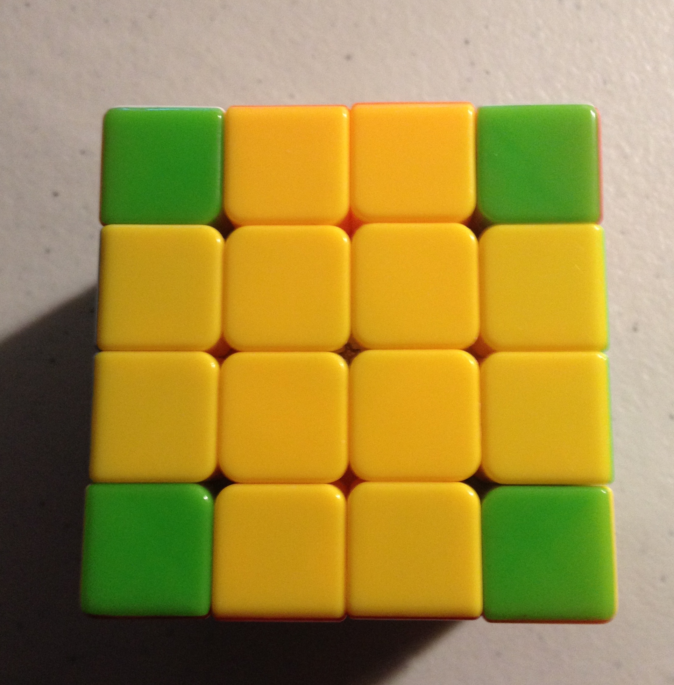
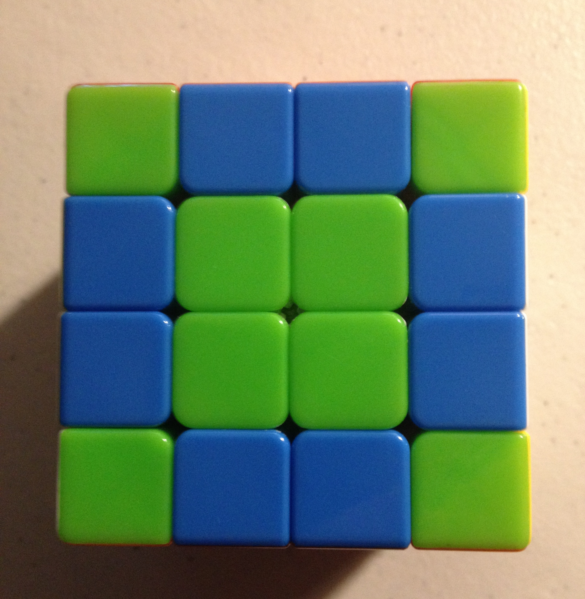
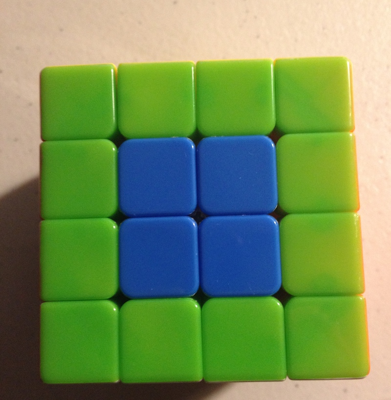
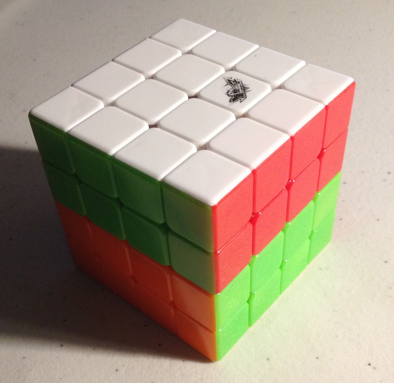

Title: 4x4 Rubik's Cube: Part 1: Representations
Date: 2018-01-11 15:00
Category: Rubiks Cube
Tags: rubiks cube, mathematics, combinatorics, permutations, python, puzzles

*This is Part 1 of a 3-part blog post 
on the mathematics of the 4x4 Rubik's Cube, 
its relation to algorithms, and some 
curious properties of Rubik's Cubes.*

# Table of Contents

* [Introduction: Why the Rubik's Cube](#rubiks1-intro)
    * [Why the 4x4 Rubik's Cube](#rubiks1-intro-why)

* [How the Rubik's Cube Works](#rubiks1-how)
    * [The Pieces](#rubiks1-how-pieces)
    * [Face Notation](#rubiks1-how-face)
    * [Color Notation](#rubiks1-how-color)
    * [Move Notation](#rubiks1-how-move)
        * [Regular Face Rotations](#rubiks1-how-move-regular)
        * [Reverse Face Rotations](#rubiks1-how-move-reverse)
        * [Double Face Rotations](#rubiks1-how-move-double)
        * [Second Layer Face Rotations](#rubiks1-how-move-second)

* [Computer Representation of a Rubik's Cube](#rubiks1-computer)
    * [Operations and Functionality](#rubiks1-computer-operations)
    * [Face Numbering](#rubiks1-computer-face)

* [Tuple](#rubiks1-tuple)
    * [Tuple Representation Requirements](#rubiks1-tuple-requirements)
    * [Tuple Representation](#rubiks1-tuple-representation)

* [Preview of Part 2](#rubiks1-preview)

* [References](#rubiks1-references)


<a name="rubiks1-intro"></a>
# Introduction: Why The Rubik's Cube

In this series of three posts, we'll take a look at the 
4x4 Rubik's Cube. The Rubik's Cube is an interesting
puzzle that has some profound mathematical connections
to group theory and combinatorics.

Group theory is a branch of mathematics that applies to 
any system that exhibits symmetry; combinatorics is the 
mathematics of counting things.

The Rubik's Cube gives us the opportunity to apply
concepts in group theory and combinatorics to 
better understand how the cube works, and to learn
how to apply these principles to real world systems.

Finally, we will wrap up by discussing some of the 
algorithms that are required to deal with a 
Rubik's Cube computationally.

In the next two posts, we'll talk more abou the
mathematical representation of permutations of 
the Rubik's Cube, and how to use this representation 
to understand some of the properties of move 
sequences when applied to the cube.

<a name="rubiks1-intro-why"></a>
## Why The 4x4 Rubik's Cube

The 4x4 Rubik's cube, also known as the Rubik's Revenge cube, 
is larger than the standard 3x3 Rubik's Cube. The 4x4 cube 
exhibits some particularly interesting properties as a result
of having an even number of squares on each edge. 

We are also interested in the 4x4 because we enjoy solving it!

<a name="rubiks1-how"></a>
# How the Rubik's Cube Works

Let's start with a discussion of cube mechanics, since this 
is important to coming up with an accurate mathematical model
of the cube.

<a name="rubiks1-how-pieces"></a>
## The Pieces

The 4x4 Rubik's Cube consists of six faces of sixteen squares 
each, for a total of 96 face squares. These face squares are 
not completely interchangeable, however - the 4x4 cube is actually
composed of three types of pieces, called "cubies".


**Figure 1: Corner pieces are green.**

The first type of piece is a **corner piece**, which contains 
3 faces. Note that it is impossible for the corner pieces
to change their chirality (direction of rotation).
There are 8 corner pieces, each of which can be oriented
in 3 different ways. 


**Figure 2: Double edge pieces are blue.**

The second type of piece is a **double edge (dedge) piece**.
Each edge is composed of two double edges. There are 
24 total double edge pieces, which can be further classified
into 12 left-handed and 12 right-handed dedge pieces.


**Figure 3: Center pieces are blue.**

Lastly, there are 4 **center pieces** in the center of each
face, for a total of 24 center pieces. Note that each of the 
center pieces of a givne color are interchangeable, unlike 
the double edge pieces or corners.

<a name="rubiks1-how-face"></a>
## Face Notation

To refer to particular faces on the cube, we use six
letters to indicate different faces:

`U` - upper face (the top of the cube)

`D` - downward face (the bottom of the cube0

`F` - front face (the front of the cube)

`B` - back face (the back side of the cube)

`L` - left face of the cube (on the left side when facing the front F face)

`R` - right face of the cube

This will help refer to how we will roate the cube.

<a name="rubiks1-how-color"></a>
## Color Notation

In the solved state, each cube face has one of six colors.
The orientation of these colors relative to one another
is always fixed; the red and orange colored faces, for example,
are never adjacent. This is due to the nature of the mechanical
pieces that compose the Rubik's Cube.

The standard faces for each color on a solved cube are:

* `U` = White
* `D` = Yellow
* `F` = Green
* `B` = Blue (Back-Blue)
* `L` = Orange
* `R` = Red (Red-Right)

Note that on a 3x3 cube, we can always determine the
final color a face will have, because the six center pieces
on each side of a 3x3 cube always remain fixed.

On a 4x4 cube, however, all four center squares can rotate 
and move, meaning all 24 center squares are totally 
interchangeable, and there is no link between the 
center colors on a 4x4 cube and the final color
that will be on that face when the cube is solved.

<a name="rubiks1-how-move"></a>
## Move Notation

using the face notation explained above, we can denote 
multiple types of moves on the Rubik's Cube.

We have 36 total moves that we can make on the Rubik's Cube,
which can be grouped by the dozen:

```
L l r R
U u d D
B b f F

L' l' r' R'
U' u' d' D'
B' b' f' F'

2L 2L' 2R 2R'
2U 2U' 2D 2D'
2B 2B' 2F 2F'
```

Let's go through those a little more slowly.

<a name="rubiks1-how-move-regular"></a>
### Regular Face Rotations

The regular face turns are denoted with capital letters:
`L R U D B F` refer to a single clockwise rotation of the 
respective face. Here, "clockwise" means *the direction
that is clockwise when facing the given face head-on.*

<a name="rubiks1-how-move-reverse"></a>
### Reverse Face Rotations

The `'` apostrophe following moves, as in `L' R' U' D' B' F'`,
indicates that the move shoud be a *counter-clockwise* 
rotation of the given face, instead of clockwise.

<a name="rubiks1-how-move-double"></a>
### Double Face Rotations

Rotations that are indicated using a lowercase letter
refer to two-layer rotations: `l r u d b f`.


**Figure 4: Cube state after move `u`.**

That is, the lowercase `u` refers to the *clockwise* 
rotation of the top two layers of the cube; 
the lowercase `r` refers to the *clockwise* 
rotation of the rightmost two
layers of the cube; and so on.

The apostrophe also serves to indicate a 
*counter-clockwise* rotation: `'l r' u' d' b' f'`
indicate counter clockwise rotations of the two
left, two right, two upper, two bottom, two back,
and two front layers, respectively.

We have covered the first 24 moves - 
clockwise and counter-clockwise rotations
of single and double layers.

<a name="rubiks1-how-move-second"></a>
### Second Layer Face Rotations


**Figure 5: Cube state after move `2U`.**

The `2` notation indicates a rotation of the second layer only. 
For example, `2U` refers to the clockwise rotation of the second 
layer from the top. This is equivalent to the move sequence 
`u U'`.

Likewise, the apostrophe indicates a counterclockwise rotation.

<a name="rubiks1-computer"></a>
# Computer Representation of a Rubik's Cube

The computer representation we are using is the 
[rubiks-cube-NxNxN-solver](https://github.com/dwalton76/rubiks-cube-NxNxN-solver)
library by Github user [@dwalton](https://github.com/dwalton76/).

We have modified this library to provide additional
functionality needed in the project; the fork used 
in this project is available at git.charlesreid1.com:
[rubiks-cube-nnn-solver](https://charlesreid1.com:3000/charlesreid1/rubiks-cube-nnn-solver)

Using this library, here's how we create a 4x4
Rubik's Revenge cube:

```
In [1]: from rubikscubennnsolver.RubiksCube444 import RubiksCube444, solved_4x4x4

In [2]: order = 'URFDLB'

In [3]: cube = RubiksCube444(solved_4x4x4, order)

In [4]: cube.print_cube()
         U U U U
         U U U U
         U U U U
         U U U U

L L L L  F F F F  R R R R  B B B B
L L L L  F F F F  R R R R  B B B B
L L L L  F F F F  R R R R  B B B B
L L L L  F F F F  R R R R  B B B B

         D D D D
         D D D D
         D D D D
         D D D D
```

<a name="rubiks1-computer-operations"></a>
## Operations and Functionality

Some important functionality:

* Obtaining each side
* Applying rotation
* Applying sequence of rotations
* Each side
* Side face numberings, centers, edges

To obtain each side, use the `sides` attribute:

```
In [8]: print(cube.sides)
OrderedDict([('U', <rubikscubennnsolver.RubiksSide.Side object at 0x11172d358>), 
             ('L', <rubikscubennnsolver.RubiksSide.Side object at 0x11172d240>), 
             ('F', <rubikscubennnsolver.RubiksSide.Side object at 0x11172d5c0>), 
             ('R', <rubikscubennnsolver.RubiksSide.Side object at 0x11172d5f8>), 
             ('B', <rubikscubennnsolver.RubiksSide.Side object at 0x11172d518>), 
             ('D', <rubikscubennnsolver.RubiksSide.Side object at 0x11172d390>)])
```

Each Side object has a long list of methods, including methods
to obtain the index numbers of corner, edge, or center faces 
on a particular side.

To apply a rotation of a single face, 
use the `rotate()` method and pass the 
name of the face:

```
In [10]: cube.rotate("U")

In [11]: cube.print_cube()
         U U U U
         U U U U
         U U U U
         U U U U

F F F F  R R R R  B B B B  L L L L
L L L L  F F F F  R R R R  B B B B
L L L L  F F F F  R R R R  B B B B
L L L L  F F F F  R R R R  B B B B

         D D D D
         D D D D
         D D D D
         D D D D
```

Unfortunately, the rotate method does not 
take sequences of moves, but this is easily
resolved:

```
In [12]: cube = RubiksCube444(solved_4x4x4, order)

In [13]: sequence = "U L U' L'"

In [14]: for move in sequence.split():
    ...:     cube.rotate(move)
    ...:

In [15]: cube.print_cube()
         L U U U
         U U U U
         U U U U
         U B B L

D F F F  R L L F  U R R R  B B B B
L L L L  F F F F  R R R R  B B B U
L L L L  F F F F  R R R R  B B B U
L L L L  F F F F  R R R R  B B B U

         D D D D
         D D D D
         D D D D
         B D D D
```

<a name="rubiks1-computer-face"></a>
## Face Numbering

Here is the numerical representation of the faces,
which we will make extensive use of:

```
In [6]: cube.print_cube_layout()
             01 02 03 04
             05 06 07 08
             09 10 11 12
             13 14 15 16

17 18 19 20  33 34 35 36  49 50 51 52  65 66 67 68
21 22 23 24  37 38 39 40  53 54 55 56  69 70 71 72
25 26 27 28  41 42 43 44  57 58 59 60  73 74 75 76
29 30 31 32  45 46 47 48  61 62 63 64  77 78 79 80

             81 82 83 84
             85 86 87 88
             89 90 91 92
             93 94 95 96
```


<a name="rubiks1-tuple"></a>
# Tuple Representation

We have a goal of finding a way of representing the 
state of the 4x4 Rubik's Revenge using a tuple, 
which is a mathematical object that will enable us
to investigate properties of sequences, moves, and 
rotations.

It is important to note that the mechanics of the
cube restrict some of the 96 total faces to only 
occur in particular configurations. By using a 
tuple of 96 integers, we are overspecifying the 
state of the cube, and we would be able to do much 
better if our goal were a minimal representation 
of the Rubik's Cube state.

However, our goal is *not* a minimal representation
of the cube, but a *unique* representation of the cube.
As we will see in a later post, the schema we use
does not actually matter, so long as we can 
represent each unique state of the cube using a sequence
of integers of arbitrary length.

<a name="rubiks1-tuple-requirements"></a>
## Tuple Representation Requirements

The 4x4 cube, in the solved state, has a few representations:

* Face indciators UDFBLR
* Colors WYGBRO
* Integers 1-96

Here is how the faces representation looks:

```
In [17]: cube.print_cube()
         U U U U
         U U U U
         U U U U
         U U U U

L L L L  F F F F  R R R R  B B B B
L L L L  F F F F  R R R R  B B B B
L L L L  F F F F  R R R R  B B B B
L L L L  F F F F  R R R R  B B B B

         D D D D
         D D D D
         D D D D
         D D D D
```

The equivalent color representation is:

```
         W W W W
         W W W W
         W W W W
         W W W W

O O O O  G G G G  R R R R  B B B B
O O O O  G G G G  R R R R  B B B B
O O O O  G G G G  R R R R  B B B B
O O O O  G G G G  R R R R  B B B B

         Y Y Y Y
         Y Y Y Y
         Y Y Y Y
         Y Y Y Y
```

However, the tuple representation *cannot* use 
colors to represent the state of the cube.
This is because a tuple representation using 
"R" to represent each red face would give us no
way of distinguishing between the (non-interchangeable)
red faces on the cube. For example, if the 
red-green double edge piece were replaced 
with a red-blue double edge piece, oriented
with the red face at the same location,
the n-tuple needs to reflect that this face
has a different value than it did the prior move.

For this reason, we must use an integer to index 
each distinct face:

```
             01 02 03 04
             05 06 07 08
             09 10 11 12
             13 14 15 16

17 18 19 20  33 34 35 36  49 50 51 52  65 66 67 68
21 22 23 24  37 38 39 40  53 54 55 56  69 70 71 72
25 26 27 28  41 42 43 44  57 58 59 60  73 74 75 76
29 30 31 32  45 46 47 48  61 62 63 64  77 78 79 80

             81 82 83 84
             85 86 87 88
             89 90 91 92
             93 94 95 96
```

We can rearrange this into a 96-tuple:

```
(1 2 3 4 5 6 7 8 9 10 11 12 13 14 15 16 17 18 19 20 21 22 23 24 25 26 27 28 29 30 31 32 33 34 35 36 37 38 39 40 41 42 43 44 45 46 47 48 49 50 51 52 53 54 55 56 57 58 59 60 61 62 63 64 65 66 67 68 69 70 71 72 73 74 75 76 77 78 79 80 81 82 83 84 85 86 87 88 89 90 91 92 93 94 95 96)
```

If we apply a rotation, for example `U R`, 
we will end up with a different cube:

```
             13 09 05 01
             14 10 06 02
             15 11 07 03
             48 44 40 36

33 34 35 84  61 57 53 49  16 66 67 68  17 18 19 20
21 22 23 24  37 38 39 88  62 58 54 50  12 70 71 72
25 26 27 28  41 42 43 92  63 59 55 51  08 74 75 76
29 30 31 32  45 46 47 96  64 60 56 52  04 78 79 80

             81 82 83 77
             85 86 87 73
             89 90 91 69
             93 94 95 65
```

This particular sequence of moves results in 
a cube state uniquely represented by the following 
96-tuple:

```
(13 9 5 1 14 10 6 2 15 11 7 3 48 44 40 36 33 34 35 84 21 22 23 24 25 26 27 28 29 30 31 32 61 57 53 49 37 38 39 88 41 42 43 92 45 46 47 96 16 66 67 68 62 58 54 50 63 59 55 51 64 60 56 52 17 18 19 20 12 70 71 72 8 74 75 76 4 78 79 80 81 82 83 77 85 86 87 73 89 90 91 69 93 94 95 65)
```

<a name="rubiks1-tuple-representation"></a>
## Tuple Representation 

Now, we have managed to find a unique representation for any given cube state 
by labeling each individual face 1-96.

But we aren't quite done yet. It turns out that our 
statement, that our representation should treat each
face as unique, is not strictly true for all 96 faces.

The square pieces are completely interchangeable, due to 
the fact that they are not connected to any other faces
(and therefore have no orientation or way of differentiating
them from one another).

If we are doing anything that involves counting 
configurations, it is important to account for this fact,
by treating the following groups of face indices as
interchangeable:

```
(6, 7, 10, 11)
(22, 23, 26, 27)
(38, 39, 42, 43)
(54, 55, 58, 59)
(70, 71, 74, 75)
(86, 87, 90, 91)
```

In Part 2 and Part 3 of this series, we will 
encounter these concepts again, and it will
become more clear what these caveats and 
notes mean through example.

Following is a preview of Part 2 of this 3-part blog post.


<a name="rubiks1-preview"></a>
# Preview of Part 2

In Part 2 of this series, we will utilize the n-tuple representation
of the 4x4 Rubik's Cube in order to write permutations of the cube
corresponding to specific states, and turn a sequence of moves on the 
cube into permutations.

We will also create a map for each type of move, telling us 
where each face index will end up.

In Part 3 we will use these to predict properties of 
rotations applied to the 4x4 Rubik's Cube.


<a name="rubiks1-references"></a>
# References

1. "Rubik's Cube". Charlesreid1.com wiki, Charles Reid. Edited 11 January 2017. Accessed 11 January 2017.
<[https://charlesreid1.com/wiki/Rubiks_Cube](https://charlesreid1.com/wiki/Rubiks_Cube)>

1. "Rubik's Revenge". Charlesreid1.com wiki, Charles Reid. Edited 11 January 2017. Accessed 11 January 2017.
<[https://charlesreid1.com/wiki/Rubiks_Revenge](https://charlesreid1.com/wiki/Rubiks_Revenge)>

3. "Rubik's Cube/Tuple". Charlesreid1.com wiki, Charles Reid. Edited 11 January 2017. Accessed 11 January 2017.
<[https://charlesreid1.com/wiki/Rubiks_Cube/Tuple](https://charlesreid1.com/wiki/Rubiks_Cube/Tuple)>

3. "Rubik's Cube/Permutations". Charlesreid1.com wiki, Charles Reid. Edited 11 January 2017. Accessed 11 January 2017.
<[https://charlesreid1.com/wiki/Rubiks_Cube/Permutations](https://charlesreid1.com/wiki/Rubiks_Cube/Permutations)>

4. "Github - dwalton76/rubiks-cube-NxNxN-solver". dwalton76, Github Repository, Github Inc. Accessed 11 January 2017.
<[https://github.com/dwalton76/rubiks-cube-NxNxN-solver](https://github.com/dwalton76/rubiks-cube-NxNxN-solver)>

5. "Rubik's Cube NxNxN Solver". Git repository, git.charlesreid1.com. Charles Reid. Updated 11 January 2017.
<[https://charlesreid1.com:3000/charlesreid1/rubiks-cube-nnn-solver](https://charlesreid1.com:3000/charlesreid1/rubiks-cube-nnn-solver)>

6. "Rubiks Cube Cycles". Git repository, git.charlesreid1.com. Charles Reid. Updated 11 January 2017.
<[https://charlesreid1.com:3000/charlesreid1/rubiks-cube-cycles](https://charlesreid1.com:3000/charlesreid1/rubiks-cube-cycles)>

