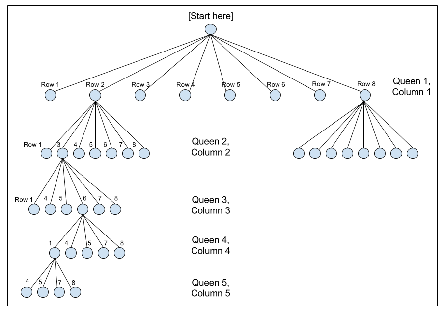

Title: Teaching Recursion with the N Queens Problem
Date: 2017-05-16 18:00
Category: Computer Science
Tags: java, algorithms, recursion, n-queens

Table of Contents:

* [A Gentle Introduction to Recursion](#8q-gentle-intro)

* [Recursive Backtracking](#8q-backtrack)

* [Paring Down the Decision Tree](#8q-decision)

* [The Pseudocode](#8q-pseudocode)

* [Accounting for Diagonal Attacks](#8q-diag)

<a name="8q-gentle-intro"></a>
## A Gentle Introduction to Recursion

Recursion, particularly recursive backtracking, is far and away the most challenging topic 
I cover when I teach the CSE 143 (Java Programming II) course at South Seattle College.
Teaching the concept of recursion, on its own, is challenging: 
the concept is a hard one to encounter in everyday life, making it unfamiliar, 
and that creates a lot of friction when students try to understand how to apply recursion. 

The key, as I tell students from day one of the recursion unit,
is to always think in terms of the base case and the recursive case.
The base case gives your brain a "trapdoor" to exit out of an otherwise 
brain-bending infinite conceptual loop. It helps recursion feel more manageable.
But most importantly: it enables thinking about recursion 
in terms of its inputs and outputs. 

More specifically, to understand recursion requires (no, not recursion)
thinking about two things: **where you enter the function** 
and **when you stop calling the function**.
These are the two *least* complicated cases, and they 
also happen to be the two *most* important cases.

College courses move at an artificially inflated pace, 
ill-suited for most community college students,
and the material prescribed must be presented at the given pace
mostly independent of any real difficulties the students face
(there is only minimal room for adjustment, *at most* 2-3 lectures).

This means that, before the students have had an opportunity to get comfortable 
with the concept of recursion, and really nail it down, they're introduced to yet another
mind-bending topic: recursive backtracking algorithms. 

These bring a whole new set of complications to the table.
Practice is crucial to students' understanding, and all too often,
the only way to get students to practice (particularly with difficult subject matter 
like recursion) is to spend substantial amounts of time in class.
My recursion lectures routinely throw my schedule off by nearly a week,
because even the simplest recursion or backtracking exercise can eat up
an hour or more.

<a name="8q-backtrack"></a>
## Recursive Backtracking

Backtracking is an approach for exploring problems that involve
making choices from a set of possible choices. A classic example of 
backtracking is the 8 Queens problem, which asks: "How many ways are there
of placing 8 queens on a chessboard, such that no queen attacks any other queen?"

The problem is deceptively simple; solving it requires some mental gymnastics.
(By the way, most people who have actually heard of the problem are computer scientists
who were exposed to it **in the process of learning how to solve it**, 
leading to the hipster effect - it's often dismissed by computer scientists as 
an "easy" problem. The curse of knowledge at work.)

The recursive backtracking algorithm requires thinking about the squares on which 
to place the 8 queens in question as the set of choices to be made. 

The naive approach ignores the constraints, and makes all 8 choices of where to place
the 8 queens before ever checking if the queen placements are valid. Thus, we could start
by placing all 8 queens in one single row on the top, or along one single column on the left.
Using this approach, we have 64 possibilities (64 open squares) for the first queen,
then 63 possibilities for the second queen, then 62 possibilities for the third queen,
and so on. This gives a total number of possible combinations of:

$$
\dfrac{64!}{(64-8)!} = 178,462,987,637,760
$$

(By the way, for those of you following along at home, you can do this calculation with Python:)

```
>>> from scipy import *
>>> math.factorial(64)/math.factorial(64-8)
178462987637760L
```

Even for someone without a sense of big numbers, like someone in Congress, 
that's still a pretty big number. Too many for a human being to actually try 
in a single lifetime.

<a name="8q-decision"></a>
## Paring Down the Decision Tree

But we can do better - we can utilize the fact that the queen, in chess,
attacks horizontally and vertically, by doing two things:

* Limit the placement of queens so that there is one queen per column;

* Limit the placement of queens so that there is one queen per row.

(Note that this is ignoring diagonal attacks; we'll get there in a minute.)

This limits the number of solutions as follows: the first queen placed on the board
must go in the first column, and has 8 possible squares in which it can go.
The second queen must go in the second column, and has 7 possible squares in which 
it can go - ignoring the square corresponding to the row that would be attacked
by the first queen. The third queen goes into the third column, which has 6 open
squares (ignoring the two rows attacked by the two queens already placed).

That leads to far fewer solutions:

$$
8! = 40,320
$$

and for those following along at home in Python:

```
>>> from scipy import *
>>> math.factorial(8)
40320
```

To visualize how this utilization of information
helps reduce the problem space, I often make use of 
a decision tree, to get the students to think about
recursive backtracking as a depth-first tree
traversal. 

(By the way, this is a strategy whose usefulness 
extends beyond the 8 queens problem, or even 
recursive backtracking problems. For example,
the problem of finding cycles in a directed graph
can be re-cast in terms of trees.)



So far, we have used two of the three directions of attack for queens.
This is also enough information to begin an implementation of an algorithm - 
a backtracking algorithm can use the fact that we place one queen per column,
and one queen per row, to loop over each row, and steadily march through each 
column sequentially (or vice-versa).

<a name="8q-pseudocode"></a>
## The Pseudocode

There is still a bit more to do to cut down on the problem space
that needs to be explored, but before we do any of that,
we should first decide on an approach and sketch out the psuedocode.

The structure of the explore method pseudocode thus looks like:

```
explore(column):
    if last column:
        # base case
        add to solutions
    else:
        # recursive case
        for each row:
            if this is a safe row:
                place queen on this row
                explore(column+1)
                remove queen from this row
```

## The Actual Code

Over at [git.charlesreid1.com/charlesreid1/n-queens](https://git.charlesreid1.com/charlesreid1/n-queens) 
I have several implementations of the N Queens problem:

* [Java solution](https://charlesreid1.com:3000/charlesreid1/n-queens/src/master/java/NQueens.java)

* [Perl solution](https://charlesreid1.com:3000/charlesreid1/n-queens/src/master/perl/nqueens.pl)

* [Python solution](https://charlesreid1.com:3000/charlesreid1/n-queens/src/master/python/nqueens.py)

* [C++ solution](https://charlesreid1.com:3000/charlesreid1/n-queens/src/master/cpp/nqueens.cpp)

## Row, Column, and Diagonal Attacks

We have already utilized knowledge that there will only be one queen 
per column, and one queen per row. But one last bit of information we can
utilize is the fact that queens attack diagonally. 
This allows us to eliminate any squares that are along the diagonals
of queens that have already been placed on the board.

How to eliminate the diagonals? It basically boils down to two approaches:

1. Use a Board class to abstract away details (and the Board class will implement "magic" like an `isValid()` method).

2. Hack the index - implement some index-based math to eliminate 
   any rows that are on the diagonals of queens already on the board.

The first approach lets you abstract away the details,
possibly even using [a Board class written by a textbook](http://www.buildingjavaprograms.com/code-files/4ed/ch12/Board.java),
which is <s>lazy</s> fine, if you are working on a practical problem
and need some elbow grease, but not so much if you are a computer science
student learning the basic principles of software design.

The second approach requires some deep thinking about how the locations of 
the N (or 8) queens are being represented in the program.

<a name="8q-diag"></a>
## Accounting for Diagonal Attacks

At some point, when you use the above pseudocode, 
you are going to want to know the answer to the following question:
**for a given column k, what rows are invalid because they are on 
diagonals of already-placed queens?**

To answer this, think about where the diagonal indices of 
chess board squares are located, and how to find the diagonals on column X 
attacked by a queen placed in column Y.

The following diagram shows a queen on row 3 of column 2, and the diagonal
attack vectors of that queen. Each of the squares along those diagonal
vectors can be ruled out as possible squares to place a queen. 
When selecting a square for the third queen, which goes in the third column, 
the second and fourth rows can both be ruled out due to the diagonals.
(The third row, of course, can also be ruled out, due to the one-queen-per-row rule.)

However, the effect of the already-placed queen propagates forward, 
and affects the choice of possible squares for each queen after it. 
If we jump ahead in the recursive algorithm, to say, queen number 6, 
being placed on column number 6 (highlighted in blue), the queen in column 2 (row 3) 
still affects the choice of squares for that column (as do all queens previously
placed on the board).  In the case pictured in the figure, 
the seventh row (as well as an off-the-board row) of column 6 
can be ruled out as possible squares for the placement of the 
6th queen.


Accounting for these diagonal attacks can lead to substantial 
speed-ups: the number of squares that can be eliminated by 
accounting for diagonal attacks is substantial 
and makes the extra index accounting worth it.
